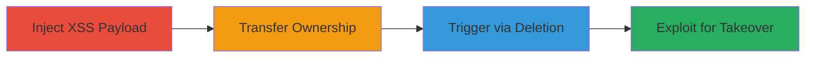

---
tags:
  - xss
  - dom-xss
  - vk.com
  - group-takeover
  - privilege-escalation
type: attack_chain
tools: []
tactics:
  - '[[Execution]]'
  - '[[Privilege Escalation]]'
verified: false
platforms:
  - Web
submitted: true
complexity: medium
created_at: '2023-10-01T00:00:00Z'
procedures:
  - '[[procedures/Inject-XSS-Payload-into-VK-Server-Name]]'
  - '[[procedures/Transfer-VK-Group-Ownership-to-New-Admin]]'
  - '[[procedures/Trigger-XSS-via-Server-Deletion]]'
  - '[[procedures/Exploit-XSS-for-Group-Control-Recovery]]'
step_count: 4
techniques:
  - '[[JavaScript]]'
  - '[[Exploit Public-Facing Application]]'
updated_at: '2025-12-14T03:46:31.527Z'
description: >-
  A multi-stage attack exploiting a DOM-based XSS vulnerability in VK.com's
  group server name field to inject malicious JavaScript, transfer ownership,
  and regain control via triggered execution during deletion.
skill_level: intermediate
impact_level: high
id: b6179bc5-2756-4c98-bef5-780af4b54cee
validated: true
mitre_tactics:
  - '[[Execution]]'
  - '[[Privilege Escalation]]'
mitre_techniques:
  - '[[JavaScript]]'
  - '[[Exploit Public-Facing Application]]'
---
# DOM-based XSS in VK Group Server Name for Admin Takeover

Multi-stage attack chain demonstrating a complete attack workflow exploiting a DOM-based XSS in VK.com's group management to inject payloads in server names, transfer ownership, and execute JavaScript for regaining control.

## Chain Metrics Dashboard

| Metric | Value |
|--------|-------|
| Chain Status | Unverified |
| Total Steps | 4 |
| Execution Time | ~5 minutes |
| Skill Level | Intermediate |
| Complexity | Medium |
| Impact Level | High |

## Attack Flow Visualization

## Prerequisites & Requirements

### Required Tools

- Web browser (e.g., Chrome with developer tools for payload testing)

### Target Environment

- VK.com web platform
- Active VK group with admin privileges
- No specific ports or services beyond standard HTTPS access

### Initial Access Requirements

- Valid VK account with admin access to a group
- Ability to create and manage group servers
- Network access to VK.com

## Detailed Attack Procedures

### Step 1: Inject XSS Payload into Server Name
procedure: [[procedures/Inject-XSS-Payload-into-VK-Server-Name]]

**Objective**: Introduce a malicious JavaScript payload into the server name field during creation, bypassing character limits to enable DOM-based XSS.

**Instructions**: Log in to VK.com as a group admin. Navigate to the group's management section, select "Servers," and create a new server. In the server name field, enter a payload such as `` or `<a href="javascript:alert('XSS')">test</a>`. Despite character limits, these tags are not sanitized and will be reflected during later interactions. Save the server to persist the payload.

**Expected Output**: Server created successfully with the injected payload in its name, visible in the group interface without immediate execution.

**Success Indicators**:
- Payload appears in server name without errors
- No sanitization breaks the tag structure

### Step 2: Transfer Group Ownership to New Admin
procedure: [[procedures/Transfer-VK-Group-Ownership-to-New-Admin]]

**Objective**: Legitimately hand over group control to a new admin, setting up conditions for the XSS to trigger in their session.

**Instructions**: From the group settings, initiate the ownership transfer process by inviting or selecting a new admin. Confirm the sale or handover, ensuring the new admin accepts ownership. Leave the group yourself to complete the transfer, leaving the malicious server intact.

**Expected Output**: Ownership successfully transferred; old admin is no longer in the group, but the server with payload remains.

**Success Indicators**:
- New admin receives and accepts ownership
- Server list still shows the injected name

### Step 3: Trigger XSS via Server Deletion
procedure: [[procedures/Trigger-XSS-via-Server-Deletion]]

**Objective**: Prompt the new admin to delete the server, causing the unsanitized server name to be rendered and execute the payload in their browser context.

**Instructions**: As the old admin, communicate with the new admin (e.g., via external means) to request or trick them into deleting the suspicious server. When the new admin navigates to the server management and selects delete, the server name is processed in the DOM without proper escaping, triggering the JavaScript execution.

**Expected Output**: JavaScript from the payload executes in the new admin's browser, such as alerting a message or loading external resources.

**Success Indicators**:
- New admin's browser executes the payload (observable via network requests or alerts)
- No server-side sanitization prevents rendering

### Step 4: Exploit XSS for Group Control Recovery
procedure: [[procedures/Exploit-XSS-for-Group-Control-Recovery]]

**Objective**: Leverage the executed JavaScript to perform unauthorized actions, such as session hijacking or direct group modifications, to reclaim ownership.

**Instructions**: With the payload executing (e.g., using ``), capture the new admin's session cookies or tokens. Use the stolen session to log in as the new admin via another browser or tool, then revert ownership or perform admin actions to regain full control.

**Expected Output**: Attacker gains access to the new admin's session, allowing group management changes like re-adding the old admin as owner.

**Success Indicators**:
- Session data exfiltrated to attacker-controlled server
- Group ownership successfully recovered

## Attack Chain Summary

### Key Achievements

1. Successful injection of XSS payload in a persistent field
2. Ownership transfer without payload removal
3. Triggered execution in victim admin's context
4. Privilege escalation via session hijacking for takeover

## Technique & Tactic Coverage

### MITRE ATT&CK Techniques

- [[JavaScript]]
- [[Exploit Public-Facing Application]]

### MITRE ATT&CK Tactics

- [[Execution]]
- [[Privilege Escalation]]

---
*Last updated: 2023-10-01T00:00:00Z*
