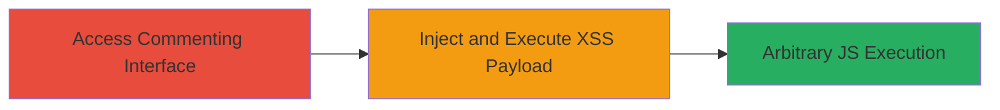

---
tags:
  - xss
  - dom-xss
  - javascript
  - web
type: attack_chain
tools: []
tactics:
  - '[[Execution]]'
verified: false
platforms:
  - Web
submitted: true
complexity: medium
created_at: '2023-10-01T00:00:00Z'
procedures:
  - '[[procedures/Access-VK-Commenting-Feature]]'
  - '[[procedures/Exploit-DOM-XSS-in-Community-Dropdown]]'
step_count: 2
techniques:
  - '[[JavaScript]]'
updated_at: '2025-12-14T03:16:14.368Z'
description: >-
  A multi-stage attack exploiting a DOM-based XSS vulnerability in VK.com's
  community selection dropdown, allowing arbitrary JavaScript execution to
  hijack sessions or steal data.
skill_level: intermediate
impact_level: high
id: 42ba1190-1ded-4f53-8d3b-8fed3ca0f5c3
validated: true
mitre_tactics:
  - '[[Execution]]'
mitre_techniques:
  - '[[JavaScript]]'
---
# DOM-based XSS in VK.com Community Selection Dropdown for Comment Posting

Multi-stage attack chain demonstrating exploitation of a DOM-based XSS vulnerability in VK.com's commenting feature, specifically the dropdown for selecting communities when posting on behalf of a group. This allows attackers to inject and execute arbitrary JavaScript in victims' browsers, potentially leading to session hijacking, data theft, or further client-side attacks.

## Chain Metrics Dashboard

| Metric | Value |
|--------|-------|
| Chain Status | Unverified |
| Total Steps | 2 |
| Execution Time | ~5 minutes |
| Skill Level | Intermediate |
| Complexity | Medium |
| Impact Level | High |

## Attack Flow Visualization

## Prerequisites & Requirements

### Required Tools

- Browser with developer tools (e.g., Chrome DevTools)

### Target Environment

- VK.com web platform
- Active user session on VK.com
- Access to commenting features

### Initial Access Requirements

- Valid VK.com account
- Network access to vk.com
- No prior elevated privileges needed; exploits user-level access

## Detailed Attack Procedures

### Step 1: Access Commenting Interface
procedure: [[procedures/Access-VK-Commenting-Feature]]

**Objective**: Navigate to the VK.com commenting section and trigger the community selection dropdown to prepare for payload injection.

**Instructions**: Log in to VK.com with a test account, navigate to a post or area where comments can be made on behalf of a community, and open the dropdown for community selection. This interface reflects user input directly into the DOM without proper sanitization.

**Expected Output**: The community selection dropdown appears, ready for input manipulation.

**Success Indicators**:
- Dropdown loads successfully
- Input field for community search/selection is visible

### Step 2: Inject and Execute XSS Payload
procedure: [[procedures/Exploit-DOM-XSS-in-Community-Dropdown]]

**Objective**: Inject a malicious JavaScript payload into the community selection input, causing it to be reflected and executed in the DOM, leading to arbitrary code execution in the victim's browser.

**Instructions**: In the community search input of the dropdown, enter a payload such as `` or a more advanced one like ``. The input is reflected unsanitized into the DOM, executing the script upon rendering.

**Expected Output**: Alert box or console log showing execution of the injected script, confirming XSS.

**Success Indicators**:
- JavaScript executes (e.g., alert pops up)
- Access to DOM elements like cookies or session data is possible

## Attack Chain Summary

### Key Achievements

1. Successful access to vulnerable commenting interface on VK.com
2. Injection and execution of arbitrary JavaScript via DOM reflection
3. Potential for session hijacking or data exfiltration from victim browsers

## Technique & Tactic Coverage

### MITRE ATT&CK Techniques

- [[JavaScript]]

### MITRE ATT&CK Tactics

- [[Execution]]

---
*Last updated: 2023-10-01T00:00:00Z*
