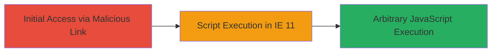

# DOM-based XSS in Xiaomi d.miwifi.com Affecting Internet Explorer 11

Multi-stage attack chain demonstrating a complete attack workflow.

## Chain Metrics Dashboard

| Metric | Value |
|--------|-------|
| Chain Status | Unverified |
| Total Steps | 1 |
| Execution Time | ~1 minutes |
| Skill Level | Novice |
| Complexity | Low |
| Impact Level | Low |

## Attack Flow Visualization



## Prerequisites & Requirements

### Required Tools

- Browser: Internet Explorer 11

### Target Environment

- Target Platform: Web (d.miwifi.com domain)
- Required services/ports: HTTP/HTTPS on port 80/443
- Network access requirements: Internet access to d.miwifi.com

### Initial Access Requirements

- Credential requirements: None (public-facing)
- Network position: External attacker
- Prior access needed: None

## Detailed Attack Procedures

### Step 1: Exploit DOM-based XSS
procedure: [[procedures/Exploit-DOM-based-XSS-on-d.miwifi.com]]

**Objective**: Inject and execute arbitrary JavaScript in the victim's browser by manipulating the DOM on d.miwifi.com, specific to IE 11.

**Instructions**: Craft a malicious URL or input that triggers DOM manipulation leading to script injection. For example, use a payload that exploits URL parameters parsed unsafely in JavaScript on the page:

```javascript
javascript:alert('XSS')
```

Deliver this via a phishing link or reflected input to an IE 11 user visiting d.miwifi.com. Monitor for alert popup or script execution.

**Expected Output**: Execution of injected script, such as an alert box or data exfiltration attempt.

**Success Indicators**:
- Alert or console log appears in IE 11
- No execution in modern browsers (confirms IE 11 specificity)

## Attack Chain Summary

### Key Achievements

1. Successful script injection via DOM manipulation
2. Browser-specific exploitation confirming low-impact scope
3. Demonstration of potential for session hijacking or data theft in affected browser

## Technique & Tactic Coverage

### MITRE ATT&CK Techniques

- [[JavaScript]]

### MITRE ATT&CK Tactics

- [[Execution]]

---
*Last updated: 2023-10-01T00:00:00Z*
