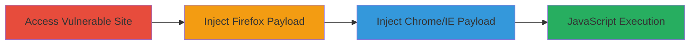

# DOM-based XSS in prettyPhoto Plugin via URL Hash Manipulation

Multi-stage attack chain demonstrating exploitation of a DOM-based XSS vulnerability in the prettyPhoto jQuery lightbox plugin on Uber's engineering subdomain, allowing arbitrary JavaScript execution without server interaction.

## Chain Metrics Dashboard

| Metric | Value |
|--------|-------|
| Chain Status | Unverified |
| Total Steps | 3 |
| Execution Time | ~2 minutes |
| Skill Level | Intermediate |
| Complexity | Medium |
| Impact Level | High |

## Attack Flow Visualization

## Prerequisites & Requirements

### Required Tools

- [[tools/DominatorPro]]

### Target Environment

- Web platform with JavaScript enabled browsers (Firefox, Chrome, IE)
- Access to eng.uber.com subdomain
- No specific ports or services required beyond HTTP/HTTPS

### Initial Access Requirements

- Public internet access
- No credentials needed
- Victim must interact with the crafted URL (e.g., via phishing or direct sharing)

## Detailed Attack Procedures

### Step 1: Access Vulnerable Subdomain
procedure: [[procedures/Access-Vulnerable-Uber-Engineering-Subdomain]]

**Objective**: Load the target page to initialize the vulnerable prettyPhoto plugin for hash-based manipulation.

**Instructions**: Open a web browser and navigate to the vulnerable subdomain URL. This loads the page with the prettyPhoto plugin, setting the stage for DOM manipulation via URL fragments.

**Expected Output**: The eng.uber.com homepage loads, with prettyPhoto script active in the DOM (verifiable via browser developer tools inspecting for prettyPhoto initialization).

**Success Indicators**:
- Page loads without errors
- Browser console shows no blocking issues for JavaScript execution

### Step 2: Inject Firefox-Specific XSS Payload
procedure: [[procedures/Inject-Firefox-XSS-Payload-via-URL-Hash]]

**Objective**: Exploit the plugin's hash parsing in Firefox to inject an SVG-based payload that triggers onload JavaScript execution.

**Instructions**: Append the malicious hash to the base URL: `http://eng.uber.com/#prettyPhoto[i]/x,<svg/onload=alert(document.domain)>/x`. Navigate to this URL in Firefox. The plugin parses the hash, injecting the SVG element into the DOM, which executes the alert on load.

**Expected Output**: An alert box pops up displaying the document domain (e.g., "eng.uber.com"), confirming JavaScript execution.

**Success Indicators**:
- Alert triggers immediately upon URL load
- No server request for the payload; execution is client-side only

### Step 3: Inject Chrome and IE-Specific XSS Payload
procedure: [[procedures/Inject-Chrome-IE-XSS-Payload-via-URL-Hash]]

**Objective**: Use an onclick-based anchor tag payload tailored for Chrome and IE to bypass their parsing differences and execute JavaScript via the plugin's DOM insertion.

**Instructions**: Append the malicious hash to the base URL: `http://eng.uber.com/#prettyPhoto[gallery]/1,<a onclick="alert(document.domain);">/`. Navigate to this URL in Chrome or IE. The plugin processes the hash, creating an anchor element in the DOM that fires the onclick event on interaction or load.

**Expected Output**: An alert box displays the document domain upon element interaction or page processing.

**Success Indicators**:
- Alert executes in the target browser
- Payload remains unescaped due to inadequate regex sanitization in the plugin

## Attack Chain Summary

### Key Achievements

1. Successful cross-browser JavaScript execution via DOM-based XSS
2. Demonstration of session hijacking potential through arbitrary code injection
3. Highlighting of prettyPhoto's hash parameter vulnerabilities (e.g., hashIndex and hashRel)

## Technique & Tactic Coverage

### MITRE ATT&CK Techniques

- [[JavaScript]]

### MITRE ATT&CK Tactics

- [[Execution]]

---
*Last updated: 2023-10-01T00:00:00Z*
