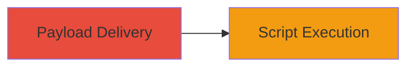

# DOM-based XSS on Adobe Website for Arbitrary Script Execution

Multi-stage attack chain demonstrating a complete attack workflow.

## Chain Metrics Dashboard

| Metric | Value |
|--------|-------|
| Chain Status | Unverified |
| Total Steps | 1 |
| Execution Time | ~5 minutes |
| Skill Level | Intermediate |
| Complexity | Medium |
| Impact Level | Medium |

## Attack Flow Visualization



## Prerequisites & Requirements

### Required Tools

- Browser Developer Tools

### Target Environment

- Web platform
- Access to www.adobe.com
- Victim's browser context

### Initial Access Requirements

- User interaction via malicious link or input
- No prior credentials needed

## Detailed Attack Procedures

### Step 1: Payload Delivery and Execution
procedure: [[procedures/Exploit-DOM-based-XSS-Vulnerability]]

**Objective**: Deliver a malicious payload to trigger DOM-based XSS, leading to arbitrary JavaScript execution in the victim's browser.

**Instructions**: Identify the vulnerable parameter or URL fragment on www.adobe.com that manipulates the DOM unsafely. Craft a payload such as a JavaScript URL (javascript:alert('XSS')) and deliver it via a phishing link or reflected input. Use browser developer tools to inspect the DOM sink (e.g., document.write or innerHTML) and confirm execution.

```javascript
// Example payload in URL
https://www.adobe.com/page?param=javascript:alert('XSS')
```

**Expected Output**: Alert box or console log confirming script execution in the context of the Adobe domain.

**Success Indicators**:
- JavaScript executes without errors
- Victim's session cookies or data accessible via script

## Attack Chain Summary

### Key Achievements

1. Successful identification of DOM-based XSS sink
2. Execution of arbitrary JavaScript in victim browser
3. Potential for data theft or session hijacking

## Technique & Tactic Coverage

### MITRE ATT&CK Techniques

- [[JavaScript]]

### MITRE ATT&CK Tactics

- [[Execution]]

---
*Last updated: 2023-10-01T00:00:00Z*
