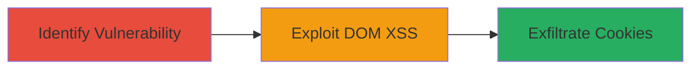

---
tags:
  - xss
  - dom-based-xss
  - cookie-theft
  - web-vulnerability
type: attack_chain
tools: []
tactics:
  - '[[Execution]]'
  - '[[Collection]]'
verified: false
platforms:
  - Web
submitted: true
complexity: low
created_at: '2023-10-01T00:00:00Z'
procedures:
  - '[[procedures/Exploit-DOM-based-XSS-for-Cookie-Theft]]'
step_count: 1
techniques:
  - '[[JavaScript]]'
updated_at: '2025-12-14T03:16:37.293Z'
description: >-
  A single-stage attack exploiting a DOM-based Cross-Site Scripting
  vulnerability on the Rockstar Games GTAOnline page to steal sensitive cookie
  values, demonstrating session data exposure.
skill_level: intermediate
impact_level: high
id: b66b0a38-6c6c-4c83-be32-85e3f458cb79
validated: true
mitre_tactics:
  - '[[Execution]]'
  - '[[Collection]]'
mitre_techniques:
  - '[[JavaScript]]'
---
# DOM-based XSS on Rockstar Games GTAOnline Page Leading to Cookie Exposure

Multi-stage attack chain demonstrating a complete attack workflow.

## Chain Metrics Dashboard

| Metric | Value |
|--------|-------|
| Chain Status | Unverified |
| Total Steps | 1 |
| Execution Time | ~5 minutes |
| Skill Level | Intermediate |
| Complexity | Low |
| Impact Level | High |

## Attack Flow Visualization

## Prerequisites & Requirements

### Required Tools

- Browser Developer Tools
- Proxy tool like Burp Suite (optional for interception)

### Target Environment

- Web platform
- Access to https://www.rockstargames.com/GTAOnline/
- No specific services/ports beyond standard HTTPS (443)

### Initial Access Requirements

- Public internet access
- No credentials required (unauthenticated vulnerability)
- No prior access needed

## Detailed Attack Procedures

### Step 1: Exploit DOM-based XSS
procedure: [[procedures/Exploit-DOM-based-XSS-for-Cookie-Theft]]

**Objective**: Inject malicious JavaScript via a vulnerable URL parameter on the GTAOnline page to execute code in the victim's browser context and steal cookie values.

**Instructions**: Navigate to the target URL https://www.rockstargames.com/GTAOnline/ and identify a sink point where user input from the URL (e.g., a query parameter or fragment) is processed unsafely by client-side JavaScript, such as through document.write, innerHTML, or eval. Craft a payload that triggers the DOM XSS, for example, appending a parameter like ?param= or using a fragment identifier #. Load the malicious URL in a browser. The payload executes, displaying or exfiltrating cookies.

**Expected Output**: Execution of the JavaScript payload, revealing cookie values in an alert or network request to an attacker-controlled server.

**Success Indicators**:
- JavaScript alert or console log showing cookie contents
- Network request to external endpoint with stolen data

## Attack Chain Summary

### Key Achievements

1. Successful injection of JavaScript via DOM manipulation
2. Exposure of sensitive session cookies
3. Demonstration of potential session hijacking risk

## Technique & Tactic Coverage

### MITRE ATT&CK Techniques

- [[JavaScript]]

### MITRE ATT&CK Tactics

- [[Execution]]
- [[Collection]]

---
*Last updated: 2023-10-01T00:00:00Z*
