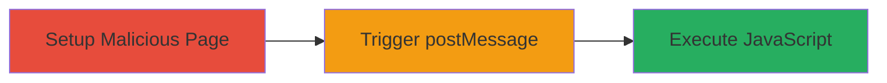

---
tags:
  - xss
  - dom-xss
  - postmessage
  - javascript-injection
type: attack_chain
tools: []
tactics:
  - '[[Initial Access]]'
  - '[[Execution]]'
verified: false
platforms:
  - Web
submitted: true
complexity: medium
created_at: '2023-10-01T00:00:00Z'
procedures:
  - '[[procedures/Setup-Malicious-POC-Page-for-postMessage]]'
  - '[[procedures/Trigger-postMessage-via-Navigation-to-Vulnerable-Page]]'
  - '[[procedures/Observe-XSS-Payload-Execution]]'
step_count: 3
techniques:
  - '[[Exploit Public-Facing Application]]'
  - '[[JavaScript]]'
updated_at: '2025-12-14T03:47:12.867Z'
description: >-
  A multi-stage attack exploiting a DOM-based XSS vulnerability in the
  postMessage event handler of the Lyst presentation notes plugin, allowing
  arbitrary JavaScript execution in the victim's browser.
skill_level: intermediate
impact_level: high
id: b9208f35-bdb6-418d-8d7c-90c54a434aa2
validated: true
mitre_tactics:
  - '[[Initial Access]]'
  - '[[Execution]]'
mitre_techniques:
  - '[[Exploit Public-Facing Application]]'
  - '[[JavaScript]]'
---
# DOM-based XSS via Insecure postMessage Handler in Lyst Presentation Notes

Multi-stage attack chain demonstrating exploitation of a DOM-based Cross-Site Scripting (XSS) vulnerability in the notes plugin of talks.lystit.com, where an insecure postMessage event handler parses data without origin validation and injects it into innerHTML, leading to arbitrary JavaScript execution.

## Chain Metrics Dashboard

| Metric | Value |
|--------|-------|
| Chain Status | Unverified |
| Total Steps | 3 |
| Execution Time | ~2 minutes |
| Skill Level | Intermediate |
| Complexity | Medium |
| Impact Level | High |

## Attack Flow Visualization

## Prerequisites & Requirements

### Required Tools

- Web browser (e.g., Chrome with developer tools)
- Local web server (e.g., Python's http.server for hosting POC)

### Target Environment

- Web platform
- Access to http://talks.lystit.com/data-saloon-presentation/plugin/notes/notes.html
- No specific ports or services beyond standard HTTP/HTTPS

### Initial Access Requirements

- Victim must visit the attacker's controlled malicious page
- No credentials required
- Attacker needs ability to host a malicious HTML page

## Detailed Attack Procedures

### Step 1: Setup Malicious POC Page
procedure: [[procedures/Setup-Malicious-POC-Page-for-postMessage]]

**Objective**: Create and host a malicious HTML page that sends crafted postMessage data to the target origin to inject XSS payload.

**Instructions**: Develop an HTML file with JavaScript that targets the vulnerable domain and sends a postMessage with malicious JSON payload, then host it locally or on a server.

**Expected Output**: A functional POC page that, when loaded, prepares to send the message upon interaction.

**Success Indicators**:
- Page loads without errors
- JavaScript console shows readiness to send postMessage

### Step 2: Trigger postMessage via Navigation
procedure: [[procedures/Trigger-postMessage-via-Navigation-to-Vulnerable-Page]]

**Objective**: Navigate from the malicious page to the vulnerable presentation notes page, triggering the postMessage event.

**Instructions**: Include a link on the POC page that opens the target URL (http://talks.lystit.com/data-saloon-presentation/plugin/notes/notes.html) in the same window or iframe, ensuring the postMessage is sent during the transition.

**Expected Output**: The vulnerable page loads, and the postMessage is dispatched with the crafted payload.

**Success Indicators**:
- Target page loads successfully
- Network tab in dev tools shows postMessage event

### Step 3: Observe XSS Payload Execution
procedure: [[procedures/Observe-XSS-Payload-Execution]]

**Objective**: Confirm arbitrary JavaScript execution by observing the injected script's effect, such as an alert dialog.

**Instructions**: The vulnerable handler receives the message, parses it, and sets innerHTML to the malicious notes content, executing the embedded script.

**Expected Output**: Alert box or other JS effect appears on the page.

**Success Indicators**:
- Alert('XSS') or similar payload executes
- Console logs confirm script injection

## Attack Chain Summary

### Key Achievements

1. Bypassed origin validation in postMessage handler
2. Injected and executed arbitrary JavaScript in victim context
3. Demonstrated potential for data theft or session hijacking

## Technique & Tactic Coverage

### MITRE ATT&CK Techniques

- [[Exploit Public-Facing Application]]
- [[JavaScript]]

### MITRE ATT&CK Tactics

- [[Initial Access]]
- [[Execution]]

---
*Last updated: 2023-10-01T00:00:00Z*
