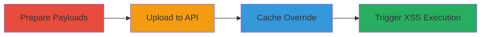

# DOM-based XSS via Malicious Graphie Upload in Khan Academy Legacy API

Multi-stage attack chain demonstrating a complete DOM-based XSS workflow exploiting Khan Academy's legacy Graphie to PNG API.

## Chain Metrics Dashboard

| Metric | Value |
|--------|-------|
| Chain Status | Unverified |
| Total Steps | 4 |
| Execution Time | ~10 minutes |
| Skill Level | Intermediate |
| Complexity | Medium |
| Impact Level | High |

## Attack Flow Visualization



## Prerequisites & Requirements

### Required Tools

- [[tools/Browser-DevTools]]

### Target Environment

- Web platform
- Access to Khan Academy's legacy Graphie API endpoints (graphie-to-png.kasandbox.org or graphie-to-png.khanacademy.systems)
- No authentication required for uploads

### Initial Access Requirements

- Public internet access
- Knowledge of existing Graphie file hashes on CDN (e.g., via inspecting Khan Academy pages)
- No prior credentials needed

## Detailed Attack Procedures

### Step 1: Prepare Malicious Payloads
procedure: [[procedures/Prepare-Malicious-SVG-and-JSON-Payloads-for-Graphie-XSS]]

**Objective**: Create SVG and JSON payloads with injectable JavaScript to bypass sanitization and execute on render.

**Instructions**: Modify an existing Graphie SVG to include an onload attribute, e.g., `<svg onload="alert('XSS')">...</svg>`. For JSON, alter labels to include `<script>alert('XSS')</script>` and set `typesetAsMath: false` to avoid math rendering and enable direct DOM insertion.

**Expected Output**: Malicious SVG string and JSON object ready for upload.

**Success Indicators**:
- Payloads validate without syntax errors
- onload or script tags are present and unescaped

### Step 2: Upload Malicious Graphie
procedure: [[procedures/Upload-Malicious-Graphie-via-Legacy-API]]

**Objective**: Post payloads to the legacy API to override an existing Graphie file on the CDN and S3.

**Instructions**: Use JavaScript to create FormData with original JS, malicious SVG, and JSON, then POST to the API endpoint. Execute using [[commands/upload-malicious-graphie-fetch]] in browser console or a script:

```javascript
var form = new FormData();
form.append("js", ORIGINAL_JS);
form.append("svg", XSS_SVG);
form.append("other_data", JSON.stringify(XSS_JSON));
await fetch("http://graphie-to-png.kasandbox.org/svg", {"method":"POST","body": form}).then(r=>r.text());
```
Replace ORIGINAL_JS, XSS_SVG, and XSS_JSON with prepared payloads, targeting a known hash like 2122427aa8dc4ef2a59058bc1a7a934ba6ca6747.svg.

**Expected Output**: Server text response indicating successful upload and file override.

**Success Indicators**:
- HTTP 200 response from API
- No errors in FormData submission

### Step 3: Wait for CDN Propagation
procedure: [[procedures/Wait-for-CDN-Cache-Update]]

**Objective**: Ensure the malicious file propagates to the CDN cache for rendering on Khan Academy pages.

**Instructions**: Monitor the CDN URL (e.g., https://cdn.kastatic.org/ka-perseus-graphie/2122427aa8dc4ef2a59058bc1a7a934ba6ca6747.svg) by repeatedly fetching it. Pre-disable cache on the original URL if needed using browser settings or devtools to force refresh.

**Expected Output**: CDN response returns the malicious SVG content.

**Success Indicators**:
- Fetch shows onload attribute or script in response
- Cache headers indicate update (e.g., no 304 Not Modified)

### Step 4: Trigger XSS Execution
procedure: [[procedures/Trigger-XSS-on-Khan-Academy-Pages]]

**Objective**: Load a page using the affected Graphie to inject and execute the payload in the victim's browser.

**Instructions**: Navigate to a Khan Academy page that embeds the targeted Graphie (e.g., a math exercise page). Use [[tools/Browser-DevTools]] to override network responses if simulating without full propagation: enable 'Override content' and replace the JSON response with the malicious version. The renderer will insert the SVG onload or JSON script directly into the DOM.

**Expected Output**: Alert or JavaScript execution (e.g., alert('XSS')) on page load.

**Success Indicators**:
- JavaScript executes in console
- DOM inspection shows injected script or event handler

## Attack Chain Summary

### Key Achievements

1. Bypassed sanitization in legacy API for SVG onload and JSON script injection
2. Overrode persistent CDN assets without authentication
3. Achieved arbitrary JS execution on unauthenticated Khan Academy users, enabling session hijacking or account takeovers

## Technique & Tactic Coverage

### MITRE ATT&CK Techniques

- [[Exploit Public-Facing Application]]
- [[JavaScript]]

### MITRE ATT&CK Tactics

- [[Initial Access]]
- [[Execution]]

---
*Last updated: 2023-10-01T00:00:00Z*
