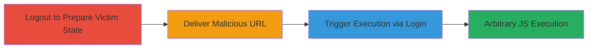

---
tags:
  - xss
  - dom-xss
  - javascript-uri
  - web-vulnerability
type: attack_chain
tools: []
tactics:
  - '[[Execution]]'
  - '[[Initial Access]]'
verified: false
platforms:
  - Web
submitted: true
complexity: medium
procedures:
  - '[[procedures/Logout-from-Semmle-Application]]'
  - '[[procedures/Visit-Malicious-Redirect-URL]]'
  - '[[procedures/Log-in-to-Trigger-XSS]]'
step_count: 3
techniques:
  - '[[JavaScript]]'
  - '[[Exploit Public-Facing Application]]'
description: >-
  A multi-step attack exploiting a DOM-based XSS vulnerability in the Semmle web
  application's redirect parameter, allowing arbitrary JavaScript execution upon
  user login.
skill_level: intermediate
impact_level: high
id: fcd38e1b-c15b-48f0-b0af-77ed6f46aa92
created_at: '2025-12-13T23:55:20.684Z'
updated_at: '2025-12-13T23:55:20.684Z'
validated: true
mitre_tactics:
  - '[[Execution]]'
  - '[[Initial Access]]'
mitre_techniques:
  - '[[JavaScript]]'
  - '[[Exploit Public-Facing Application]]'
---
# DOM-based XSS via Malicious Redirect Parameter in Semmle Application

Multi-stage attack chain demonstrating a complete attack workflow exploiting a DOM-based XSS in the Semmle web application.

## Chain Metrics Dashboard

| Metric | Value |
|--------|-------|
| Chain Status | Unverified |
| Total Steps | 3 |
| Execution Time | ~5 minutes |
| Skill Level | Intermediate |
| Complexity | Medium |
| Impact Level | High |

## Attack Flow Visualization

## Prerequisites & Requirements

### Required Tools

- None (manual browser-based attack)

### Target Environment

- Web application: Semmle (https://lgtm-com.pentesting.semmle.net/)
- Required services/ports: HTTPS (443)
- Network access requirements: Internet access to the target URL

### Initial Access Requirements

- No prior credentials needed; targets logged-out users who will log in
- Victim must visit the malicious URL and complete login
- Attacker crafts and delivers the URL (e.g., via phishing)

## Detailed Attack Procedures

### Step 1: Logout from Semmle Application
procedure: [[procedures/Logout-from-Semmle-Application]]

**Objective**: Ensure the target user is in a logged-out state to trigger the vulnerable redirect behavior during login.

**Instructions**: Manually log out from the Semmle application by navigating to the logout endpoint or clicking the logout button in the user interface.

**Expected Output**: User session ends, and the application displays a logged-out state (e.g., login prompt).

**Success Indicators**:
- User is redirected to the login page
- No active session cookies present

### Step 2: Visit Malicious Redirect URL
procedure: [[procedures/Visit-Malicious-Redirect-URL]]

**Objective**: Deliver the crafted malicious URL to the victim, setting the vulnerable redirect parameter to a javascript: URI payload.

**Instructions**: Have the victim access the URL `https://lgtm-com.pentesting.semmle.net/?redirect=javascript:prompt(document.domain)%2f%2f`. This injects the javascript: URI into the redirect parameter without immediate execution.

**Expected Output**: The page loads, but the payload remains dormant until login triggers the redirect.

**Success Indicators**:
- URL is visited successfully
- No errors on page load; victim sees the login prompt

### Step 3: Log in to Trigger XSS
procedure: [[procedures/Log-in-to-Trigger-XSS]]

**Objective**: Complete the login process to process the redirect parameter, executing the injected JavaScript in the victim's browser DOM.

**Instructions**: The victim enters their email and completes the login flow (e.g., via email verification). Upon successful authentication, the application redirects using the tainted parameter, executing `prompt(document.domain)//`.

**Expected Output**: A browser prompt displays the document domain (e.g., "lgtm-com.pentesting.semmle.net"), confirming JS execution.

**Success Indicators**:
- JavaScript alert/prompt appears post-login
- Attacker can observe or extend payload for further actions like data exfiltration

## Attack Chain Summary

### Key Achievements

1. Bypassed login protections by targeting the redirect mechanism
2. Achieved arbitrary JS execution in the authenticated context
3. Enabled potential session hijacking or data theft without direct access

## Technique & Tactic Coverage

### MITRE ATT&CK Techniques

- [[JavaScript]]
- [[Exploit Public-Facing Application]]

### MITRE ATT&CK Tactics

- [[Execution]]
- [[Initial Access]]

---
*Last updated: 2023-10-01*
