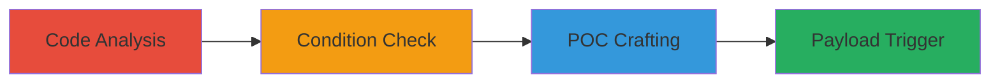

---
tags:
  - xss
  - dom-based-xss
  - referrer-injection
  - javascript-execution
type: attack_chain
tools: []
tactics:
  - '[[Execution]]'
verified: false
platforms:
  - Web
submitted: true
complexity: medium
created_at: '[TIMESTAMP]'
procedures:
  - '[[procedures/Analyze-bindBreadCrumb-Function-for-XSS]]'
  - '[[procedures/Identify-Exploitation-Conditions]]'
  - '[[procedures/Craft-Malicious-Referrer-POC]]'
  - '[[procedures/Trigger-XSS-Payload-via-Mouseover]]'
step_count: 4
techniques:
  - '[[JavaScript]]'
updated_at: '2025-12-14T03:46:31.696Z'
description: >-
  Multi-stage attack exploiting a DOM-based XSS vulnerability in the
  bindBreadCrumb function on kb.informatica.com by injecting JavaScript through
  a controlled referrer, leading to arbitrary code execution on user
  interaction.
skill_level: intermediate
impact_level: high
id: 99989d45-fba1-490d-8c4a-7da445ee4a91
validated: true
mitre_tactics:
  - '[[Execution]]'
mitre_techniques:
  - '[[JavaScript]]'
---
# DOM-based XSS via Malicious Referrer in Informatica Knowledge Base

Multi-stage attack chain demonstrating a complete attack workflow exploiting unencoded referrer insertion in breadcrumb links on kb.informatica.com.

## Chain Metrics Dashboard

| Metric | Value |
|--------|-------|
| Chain Status | Unverified |
| Total Steps | 4 |
| Execution Time | ~5 minutes |
| Skill Level | Intermediate |
| Complexity | Medium |
| Impact Level | High |

## Attack Flow Visualization

## Prerequisites & Requirements

### Required Tools

- Browser with developer tools (e.g., Internet Explorer for compatibility)
- Redirector service for referrer spoofing

### Target Environment

- Web platform
- Target: kb.informatica.com (Informatica Knowledge Base)
- Required services/ports: HTTP/HTTPS on port 80/443
- Network access requirements: Direct internet access to target

### Initial Access Requirements

- No credentials required
- External network position
- No prior access needed; relies on referrer manipulation

## Detailed Attack Procedures

### Step 1: Code Analysis
procedure: [[procedures/Analyze-bindBreadCrumb-Function-for-XSS]]

**Objective**: Review the JavaScript code to identify insecure string concatenations in the bindBreadCrumb function that enable DOM-based XSS.

**Instructions**: Examine the $(document).ready(function(){ bindBreadCrumb(); }); block and focus on assignments like strChild = '<a href="' + varDocumentReferrer + '" style="color:#999 !important;" >Search Results</a>'; where varDocumentReferrer is derived from document.referrer without encoding.

**Expected Output**: Identification of vulnerable href attribute construction using unencoded user-controlled inputs.

**Success Indicators**:
- Vulnerable code patterns confirmed
- Sources like document.referrer, document.URL, and varCoveoSearchResultPageURL noted as injectable

### Step 2: Condition Identification
procedure: [[procedures/Identify-Exploitation-Conditions]]

**Objective**: Determine the specific runtime conditions required for the XSS to trigger based on code logic.

**Instructions**: Analyze conditions such as qString('myk') != '', previousUrl (document.referrer.toLowerCase()) not containing '/home.aspx', varCoveoSearchResultPageName (from GetKBCookieValue('CoveoSearchUrl')) being empty, and varDocumentReferrer.toLowerCase().indexOf('//search.informatica.com') != -1.

**Expected Output**: List of prerequisites for exploitation, including non-empty 'myk' parameter and referrer matching '//search.informatica.com'.

**Success Indicators**:
- All conditions documented
- Feasibility assessed for controlled referrer scenarios

### Step 3: POC Crafting
procedure: [[procedures/Craft-Malicious-Referrer-POC]]

**Objective**: Construct a proof-of-concept URL using a redirector to spoof a malicious referrer that injects JavaScript into the href attribute.

**Instructions**: Use a redirector like http://spqr.zz.mu/loc.php with parameters to set the referrer to '//search.informatica.com&'/onmouseover='alert(document.domain)'' and target the vulnerable page https://kb.informatica.com/solution/4/Pages/17377.aspx?myk=xxx.

**Expected Output**: A clickable PoC link that sets the malicious referrer upon redirection.

**Success Indicators**:
- Referrer payload crafted with JavaScript injection (e.g., onmouseover alert)
- Target URL includes required 'myk' parameter

### Step 4: Payload Trigger
procedure: [[procedures/Trigger-XSS-Payload-via-Mouseover]]

**Objective**: Load the PoC in a browser and interact to execute the injected JavaScript, demonstrating arbitrary code execution.

**Instructions**: Open the PoC link in Internet Explorer, wait for the page to fully load, and hover the mouse over the 'Search Results' breadcrumb link to trigger the onmouseover event.

**Expected Output**: Alert box displaying 'informatica.com' or similar domain, confirming XSS execution.

**Success Indicators**:
- JavaScript alert fires on mouseover
- No errors in browser console; payload executes in victim context

## Attack Chain Summary

### Key Achievements

1. Identified DOM-based XSS via unencoded referrer in breadcrumb href
2. Met exploitation conditions through parameter and cookie manipulation
3. Demonstrated injection leading to onmouseover code execution
4. Highlighted potential for session hijacking or data theft

## Technique & Tactic Coverage

### MITRE ATT&CK Techniques

- [[JavaScript]]

### MITRE ATT&CK Tactics

- [[Execution]]

---
*Last updated: [TIMESTAMP]*
