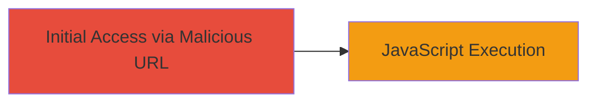

---
tags:
  - xss
  - dom-xss
  - jquery
  - web-vulnerability
type: attack_chain
tools: []
tactics:
  - '[[Execution]]'
verified: false
platforms:
  - Web
submitted: true
complexity: low
created_at: '2023-10-01T00:00:00Z'
procedures:
  - '[[procedures/Exploit-DOM-based-XSS-via-URL-Fragment]]'
step_count: 1
techniques:
  - '[[JavaScript]]'
updated_at: '2025-12-14T03:15:31.842Z'
description: >-
  A single-stage attack exploiting a DOM-based XSS vulnerability on the ownCloud
  main page through improper jQuery handling of URL fragments, allowing
  arbitrary JavaScript execution in the victim's browser.
skill_level: beginner
impact_level: high
id: 1b31f574-c093-4b66-b1ad-73abaa009aef
validated: true
mitre_tactics:
  - '[[Execution]]'
mitre_techniques:
  - '[[JavaScript]]'
---
# DOM-based XSS via Malicious URL Fragment in jQuery on ownCloud

Multi-stage attack chain demonstrating a complete attack workflow.

## Chain Metrics Dashboard

| Metric | Value |
|--------|-------|
| Chain Status | Unverified |
| Total Steps | 1 |
| Execution Time | ~1 minute |
| Skill Level | Beginner |
| Complexity | Low |
| Impact Level | High |

## Attack Flow Visualization



## Prerequisites & Requirements

### Required Tools

- Web browser (e.g., Chrome, Firefox)

### Target Environment

- Web platform
- Target URL: https://owncloud.com
- No specific services or ports required beyond standard HTTP/HTTPS

### Initial Access Requirements

- Direct access to the target's main page
- Ability to control or trick victim into visiting a malicious URL
- No credentials or prior access needed

## Detailed Attack Procedures

### Step 1: Trigger DOM-based XSS
procedure: [[procedures/Exploit-DOM-based-XSS-via-URL-Fragment]]

**Objective**: Inject a malicious URL fragment to exploit jQuery's improper handling, leading to arbitrary JavaScript execution in the browser context.

**Instructions**: Construct a malicious URL by appending a crafted fragment to the target page. The fragment uses HTML injection to break out of jQuery's parsing and execute JavaScript via an onerror handler on an invalid image source.

Navigate to the following URL in a browser:

```url
https://owncloud.com/#">
```

This URL triggers the vulnerability when the page loads and jQuery processes the fragment.

**Expected Output**: A JavaScript prompt dialog appears displaying the number 2, confirming execution.

**Success Indicators**:
- Alert/prompt box appears in the browser
- JavaScript executes without errors in the console
- Potential for further payloads to steal cookies or session data

## Attack Chain Summary

### Key Achievements

1. Successful injection of arbitrary JavaScript via URL fragment
2. Demonstration of DOM-based XSS leading to client-side code execution
3. Potential for session hijacking or data exfiltration in victim browsers

## Technique & Tactic Coverage

### MITRE ATT&CK Techniques

- [[JavaScript]]

### MITRE ATT&CK Tactics

- [[Execution]]

---
*Last updated: 2023-10-01T00:00:00Z*
