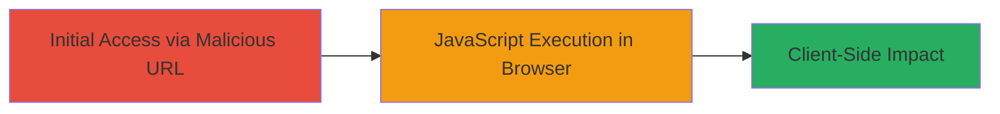

---
tags:
  - xss
  - dom-xss
  - jquery
  - browser-exploit
  - client-side
type: attack_chain
tools: []
tactics:
  - '[[Execution]]'
  - '[[Collection]]'
commands: []
platforms:
  - Web
complexity: low
procedures:
  - '[[procedures/Exploit-DOM-based-XSS-via-URL-Hash]]'
step_count: 1
techniques:
  - '[[JavaScript]]'
description: >-
  A multi-stage attack chain exploiting a DOM-based XSS vulnerability on the
  Forescout homepage by crafting a malicious URL hash that executes JavaScript
  in Microsoft Edge and Internet Explorer browsers due to improper handling by
  jQuery.
skill_level: beginner
impact_level: medium
id: a29cb0f7-4dcc-499c-8d8a-42489d3ac813
created_at: '2025-12-13T23:55:37.872Z'
updated_at: '2025-12-13T23:55:37.872Z'
verified: false
validated: true
submitted: true
mitre_tactics:
  - '[[Execution]]'
  - '[[Collection]]'
mitre_techniques:
  - '[[JavaScript]]'
---
# DOM-based XSS via Malicious URL Hash in jQuery on Forescout Homepage

## Overview

This attack chain demonstrates a DOM-based Cross-Site Scripting (XSS) vulnerability on the homepage of www.forescout.com. The vulnerability arises from jQuery code that processes the URL hash (window.location.hash) without proper encoding or sanitization, allowing arbitrary JavaScript execution in Microsoft Edge and Internet Explorer browsers. An attacker can craft a malicious URL with a hash containing an HTML element like an img tag with an onerror event, triggering an alert or other JavaScript payload. The impact includes executing malicious code in the victim's browser, enabling cookie theft, site redirection, or other client-side attacks. This chain focuses on the single-step exploitation via URL navigation.

## Chain Metrics Dashboard

| Metric | Value |
|--------|-------|
| Chain Status | Unverified |
| Total Steps | 1 |
| Execution Time | ~1 minute |
| Skill Level | Beginner |
| Complexity | Low |
| Impact Level | Medium |

## Attack Flow Visualization

## Prerequisites & Requirements

### Required Tools

- Web browser (Microsoft Edge or Internet Explorer)

### Target Environment

- Target Platform: Web
- Required Services/Ports: HTTPS (port 443)
- Network Access Requirements: Internet access to www.forescout.com

### Initial Access Requirements

- No credentials required
- Victim must visit the malicious URL in a vulnerable browser
- No prior access needed

## Detailed Attack Procedures

### Step 1: Craft and Navigate to Malicious URL
procedure: [[procedures/Exploit-DOM-based-XSS-via-URL-Hash]]

**Objective**: Trigger the DOM-based XSS by appending a malicious hash to the homepage URL, causing jQuery to execute unsanitized JavaScript in the browser.

**Instructions**: Construct the malicious URL by appending the payload to the Forescout homepage. The payload uses an img tag with an onerror event to execute JavaScript. Open the URL in Microsoft Edge or Internet Explorer to trigger the execution.

Example malicious URL:

https://www.forescout.com/#

**Expected Output**: An alert box displaying 'XSS' pops up in the browser, confirming JavaScript execution.

**Success Indicators**:
- Alert dialog appears in the browser
- Browser console shows JavaScript errors or execution logs related to the payload
- No execution in modern browsers like Chrome or Firefox due to better hash handling

## Attack Chain Summary

### Key Achievements

1. Successful execution of arbitrary JavaScript via URL hash manipulation
2. Demonstration of client-side code injection without server interaction
3. Potential for further attacks like session hijacking or phishing redirection

## Technique & Tactic Coverage

### MITRE ATT&CK Techniques

- [[JavaScript]]

### MITRE ATT&CK Tactics

- [[Execution]]
- [[Collection]]

---
*Last updated: 2024-10-01T00:00:00Z*
