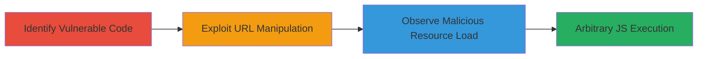

# DOM-based XSS via Protocol-Relative Base Tag in Informatica Assessment Page

Multi-stage attack chain demonstrating a DOM-based XSS vulnerability in the JavaScript code on the Informatica alpha assessment page, where a dynamically inserted <base> tag uses unsanitized window.location.pathname, enabling protocol-relative URL exploitation for arbitrary JavaScript execution.

## Chain Metrics Dashboard

| Metric | Value |
|--------|-------|
| Chain Status | Unverified |
| Total Steps | 3 |
| Execution Time | ~5 minutes |
| Skill Level | Intermediate |
| Complexity | Medium |
| Impact Level | Medium |

## Attack Flow Visualization

## Prerequisites & Requirements

### Required Tools

- [[tools/Burp-Suite]]
- [[tools/Chrome-DevTools]]

### Target Environment

- Web platform
- Access to public-facing assessment page at https://alpha.informatica.com/assessmentBase/assessment.html
- No specific services or ports required beyond standard HTTP/HTTPS

### Initial Access Requirements

- No credentials needed
- Direct network access to the target URL
- Ability to register a domain like assessmentbase for full exploitation

## Detailed Attack Procedures

### Step 1: Identify Vulnerable Code
procedure: [[procedures/Identify-DOM-XSS-in-JavaScript-Code]]

**Objective**: Passively scan the JavaScript code to identify the DOM-based XSS vulnerability in the <base> tag insertion.

**Instructions**: Configure [[tools/Burp-Suite]] as a proxy and load the target page. Use the code analysis engine to inspect the JavaScript in the <head> section, focusing on dynamic element creation.

**Expected Output**: Detection of the line setting baseHeaderElement to '<base href="'+ window.location.pathname + '" />' and appending it to the head.

**Success Indicators**:
- Vulnerable code snippet identified
- Confirmation of unsanitized pathname usage

### Step 2: Exploit URL Manipulation
procedure: [[procedures/Exploit-Protocol-Relative-Base-Tag]]

**Objective**: Manipulate the URL to trigger protocol-relative resolution, causing the browser to request resources from an attacker-controlled origin.

**Instructions**: In a browser with [[tools/Burp-Suite]] proxy active, navigate to https://alpha.informatica.com//assessmentBase/assessment.html. Use [[tools/Chrome-DevTools]] to monitor the page load and confirm the base href resolves to //assessmentbase.

**Expected Output**: Page loads with base tag href set to //assessmentbase/assessmentBase/assessment.html, leading to cross-origin resource requests.

**Success Indicators**:
- Double slash interpreted as protocol-relative
- Network requests directed to attacker domain

### Step 3: Verify XSS Impact
procedure: [[procedures/Verify-XSS-Impact-via-Network-Inspection]]

**Objective**: Observe failed resource loads that could be hijacked for XSS payload delivery.

**Instructions**: With the manipulated URL loaded, open [[tools/Chrome-DevTools]] Network tab and reload the page. Inspect requests for resources like angular.min.js from the assessmentbase origin.

**Expected Output**: Failed GET requests to https://assessmentbase/etc/designs/informatica-com/assessmentform/js/angular.min.js, demonstrating potential for malicious JS injection.

**Success Indicators**:
- Cross-origin requests observed
- Potential for arbitrary JS execution confirmed

## Attack Chain Summary

### Key Achievements

1. Passive identification of DOM XSS via code analysis
2. Successful URL manipulation for protocol-relative exploit
3. Validation of impact through network inspection, enabling reflected XSS

## Technique & Tactic Coverage

### MITRE ATT&CK Techniques

- [[Exploit Public-Facing Application]]
- [[JavaScript]]

### MITRE ATT&CK Tactics

- [[Initial Access]]
- [[Execution]]

---
*Last updated: 2023-10-01T00:00:00Z*
