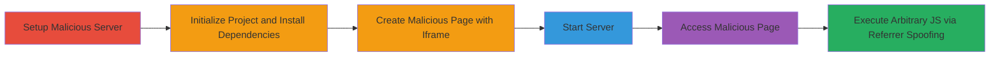

---
tags:
  - xss
  - dom-xss
  - referrer-manipulation
  - javascript-execution
type: attack_chain
tools:
  - '[[tools/Node.js]]'
  - '[[tools/npm]]'
  - '[[tools/Express]]'
tactics:
  - '[[Execution]]'
  - '[[Collection]]'
commands:
  - '[[commands/npm-init-project]]'
  - '[[commands/npm-install-express]]'
  - '[[commands/node-run-server]]'
platforms:
  - Web
complexity: medium
procedures:
  - '[[procedures/Set-Up-Malicious-Express-Server-for-XSS]]'
  - '[[procedures/Trigger-DOM-XSS-via-Iframe-Referrer-Spoofing]]'
step_count: 6
techniques:
  - '[[JavaScript]]'
  - '[[Drive-by Compromise]]'
description: >-
  Multi-stage attack exploiting a DOM-based XSS vulnerability in Acronis promo
  pages by manipulating document.referrer to load and execute arbitrary
  JavaScript from an attacker-controlled server.
skill_level: intermediate
impact_level: high
id: 318be339-8c73-4ae4-8c2c-b79eade99c98
created_at: '2025-12-13T23:56:19.697Z'
updated_at: '2025-12-13T23:56:19.697Z'
verified: false
validated: true
submitted: true
mitre_tactics:
  - '[[Execution]]'
  - '[[Collection]]'
mitre_techniques:
  - '[[JavaScript]]'
  - '[[Drive-by Compromise]]'
---
# DOM-based XSS via Referrer Manipulation in Acronis Promo Website

## Overview

This attack chain demonstrates exploitation of a DOM-based Cross-Site Scripting (XSS) vulnerability in the Acronis promotional website (e.g., https://promo.acronis.com/GL-Trial-MassTransit.html). The flaw occurs in client-side JavaScript that uses `document.write` to load a script from '/marketo/common.js' based on `document.referrer` without validation. By hosting a malicious page that embeds the vulnerable page in an iframe and spoofing the referrer to point to the attacker's domain, the victim's browser loads and executes arbitrary JavaScript from the attacker's server. This enables client-side attacks such as session hijacking, data theft, or phishing redirects. The chain involves setting up a local Node.js/Express server to host the malicious payload and triggering the exploit via browser access.

## Chain Metrics Dashboard

| Metric | Value |
|--------|-------|
| Chain Status | Unverified |
| Total Steps | 6 |
| Execution Time | ~5 minutes |
| Skill Level | Intermediate |
| Complexity | Medium |
| Impact Level | High |

## Attack Flow Visualization



## Prerequisites & Requirements

### Required Tools

- [[tools/Node.js]]
- [[tools/npm]]
- [[tools/Express]]

### Target Environment

- Web browser (e.g., Chrome, Firefox)
- Local network access for server hosting
- No specific ports required beyond localhost:5000

### Initial Access Requirements

- No credentials needed
- Attacker must control a domain or path mimicking the referrer structure
- Victim must visit the attacker's malicious page

## Detailed Attack Procedures

### Step 1: Set Up Local Server Directory
procedure: [[procedures/Set-Up-Malicious-Express-Server-for-XSS]]

**Objective**: Prepare the environment by creating a project directory and basic server file to host the malicious page and payload.

**Instructions**: Create a new directory for the project and add an `index.js` file that serves an HTML page with an iframe embedding the vulnerable Acronis URL. Ensure a `/marketo/common.js` file exists with malicious JavaScript, such as `alert('XSS exploited!')`.

**Expected Output**: Project directory with `index.js` and `common.js` files ready.

**Success Indicators**:
- Directory created successfully
- `index.js` contains Express server code serving static files and the iframe page

### Step 2: Initialize npm Project
procedure: [[procedures/Set-Up-Malicious-Express-Server-for-XSS]]

**Objective**: Set up the Node.js project structure for dependency management.

**Instructions**: Use [[commands/npm-init-project]] to initialize the project:

```bash
npm init -y
```

**Expected Output**: `package.json` file created with default settings.

**Success Indicators**:
- `package.json` present in the directory
- No errors during initialization

### Step 3: Install Express Framework
procedure: [[procedures/Set-Up-Malicious-Express-Server-for-XSS]]

**Objective**: Install the web framework needed to serve the malicious content.

**Instructions**: Execute [[commands/npm-install-express]] to add Express as a dependency:

```bash
npm i express
```

**Expected Output**: Express installed in `node_modules`, `package.json` updated.

**Success Indicators**:
- `node_modules/express` directory exists
- Installation completes without errors

### Step 4: Start the Local Server
procedure: [[procedures/Set-Up-Malicious-Express-Server-for-XSS]]

**Objective**: Launch the server to host the attack page and payload script.

**Instructions**: Run [[commands/node-run-server]] to start the Express server on port 5000:

```bash
node index.js
```

**Expected Output**: Server logs "Server running on port 5000".

**Success Indicators**:
- Server listening on http://localhost:5000
- No port binding errors

### Step 5: Create Malicious Page with Iframe
procedure: [[procedures/Trigger-DOM-XSS-via-Iframe-Referrer-Spoofing]]

**Objective**: Build the HTML page that spoofs the referrer and embeds the vulnerable iframe.

**Instructions**: In `index.js`, configure Express to serve an `index.html` with `<iframe src="https://promo.acronis.com/GL-Trial-MassTransit.html" style="width:100%; height:100vh;"></iframe>`. The referrer will be the attacker's domain/path, tricking the script load.

**Expected Output**: HTML page served at localhost:5000 with embedded iframe.

**Success Indicators**:
- Page loads without errors
- Iframe visible in browser

### Step 6: Access Malicious Page to Trigger XSS
procedure: [[procedures/Trigger-DOM-XSS-via-Iframe-Referrer-Spoofing]]

**Objective**: Visit the attack page to execute the XSS payload in the victim's context.

**Instructions**: Open http://localhost:5000 in a browser. The iframe loads the Acronis page, which uses the spoofed referrer to fetch and execute `/marketo/common.js` from the attacker's server.

**Expected Output**: Alert or other malicious JS executes (e.g., alert('XSS')).

**Success Indicators**:
- JavaScript from attacker's `common.js` runs in the iframe context
- No CSP or other blocks prevent script load

## Attack Chain Summary

### Key Achievements

1. Successful referrer spoofing via iframe embedding
2. Arbitrary JavaScript execution in victim's browser
3. Potential for data exfiltration or session theft

## Technique & Tactic Coverage

### MITRE ATT&CK Techniques

- [[JavaScript]]
- [[Drive-by Compromise]]

### MITRE ATT&CK Tactics

- [[Execution]]
- [[Collection]]

---

*Last updated: 2023-10-01*
