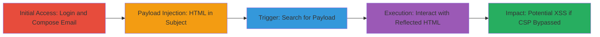

# DOM-based XSS via Unescaped Email Subject Reflection in Hey.com Search

Multi-stage attack chain demonstrating a complete attack workflow for exploiting a DOM-based XSS in the Hey.com email application through unescaped HTML in email subjects reflected in search results.

## Chain Metrics Dashboard

| Metric | Value |
|--------|-------|
| Chain Status | Unverified |
| Total Steps | 4 |
| Execution Time | ~5 minutes |
| Skill Level | Intermediate |
| Complexity | Medium |
| Impact Level | High |

## Attack Flow Visualization

## Prerequisites & Requirements

### Required Tools

- Web browser (e.g., Chrome with Developer Tools)

### Target Environment

- Web platform
- Access to Hey.com email service
- Valid user account credentials

### Initial Access Requirements

- Valid Hey.com account
- Network access to https://app.hey.com/
- No prior access needed beyond authentication

## Detailed Attack Procedures

### Step 1: Access and Authenticate to Hey.com

**Objective**: Gain access to the email composition features to prepare for payload injection.

**Instructions**: Open a web browser and navigate to the Hey.com application, then log in using valid credentials to access the email interface.

**Expected Output**: Successful login, landing on the main email dashboard.

**Success Indicators**:
- Dashboard loads without errors
- Email composition button ('Write') is visible

### Step 2: Compose and Send Malicious Email with HTML Payload
procedure: [[procedures/Compose-and-Send-Malicious-Email-with-HTML-Payload]]

**Objective**: Inject HTML payload into the email subject to test for lack of escaping during rendering.

**Instructions**: Click the 'Write' button to start composing an email, set the recipient to your own email address, and insert the payload into the subject field before sending.

**Expected Output**: Email sent successfully to self, appearing in the inbox.

**Success Indicators**:
- Email received in inbox
- Subject displays the injected HTML without immediate rendering issues

### Step 3: Trigger DOM Reflection via Search Box
procedure: [[procedures/Trigger-DOM-Reflection-via-Search-Box]]

**Objective**: Reflect the malicious subject in search results to observe DOM injection.

**Instructions**: Use the search box in the top left to query for part of the payload, causing the email subject to render in results.

**Expected Output**: Search results show the email with the injected HTML tag visible in the DOM.

**Success Indicators**:
- Injected <a> tag appears in search results
- No sanitization of HTML in rendered subject

### Step 4: Interact with Injected HTML to Attempt XSS
procedure: [[procedures/Interact-with-Injected-HTML-to-Attempt-XSS]]

**Objective**: Attempt to execute the injected JavaScript by interacting with the reflected element, observing CSP enforcement.

**Instructions**: Click on the injected link in the search results and check the browser console for execution attempts.

**Expected Output**: Alert blocked by CSP; console shows violation with policy details.

**Success Indicators**:
- CSP violation logged in console
- HTML renders but script does not execute due to policy

## Attack Chain Summary

### Key Achievements

1. Successful HTML injection into email subject without escaping
2. Reflection of unsanitized HTML in search results, enabling UI manipulation
3. Demonstration of potential XSS if CSP is bypassed, leading to account takeover risks

## Technique & Tactic Coverage

### MITRE ATT&CK Techniques

- [[JavaScript]]

### MITRE ATT&CK Tactics

- [[Execution]]

---
*Last updated: 2023-10-01T00:00:00Z*
