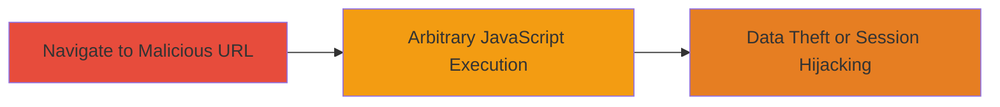

---
tags:
  - xss
  - dom-xss
  - javascript
  - web-vulnerability
type: attack_chain
tools: []
tactics:
  - '[[Execution]]'
  - '[[Collection]]'
commands: []
platforms:
  - Web
complexity: medium
procedures:
  - '[[procedures/Exploit-DOM-based-XSS-via-window-location-href]]'
step_count: 1
techniques:
  - '[[JavaScript]]'
description: >-
  A single-stage attack exploiting a DOM-based XSS vulnerability in the
  JavaScript code of docs.8x8.com by injecting malicious payloads through URL
  fragments or parameters, leading to arbitrary JavaScript execution in the
  victim's browser.
skill_level: intermediate
impact_level: medium
id: d18ab674-4b8d-44ef-8b81-53e5287990df
created_at: '2025-12-14T03:16:36.877Z'
updated_at: '2025-12-14T03:16:36.877Z'
verified: false
validated: true
submitted: true
mitre_tactics:
  - '[[Execution]]'
  - '[[Collection]]'
mitre_techniques:
  - '[[JavaScript]]'
---
# DOM-based XSS via Unsafe window.location.href Evaluation on docs.8x8.com

## Overview

This attack chain demonstrates the exploitation of a DOM-based Cross-Site Scripting (XSS) vulnerability in the marketing documentation site at docs.8x8.com. The flaw stems from the JavaScript code unsafely evaluating and rendering content derived from `window.location.href` without proper sanitization or input validation. Discovered by a security researcher on June 11, 2020, via manual testing, the vulnerability allows attackers to inject and execute arbitrary JavaScript in the context of a victim's browser. Potential impacts include session hijacking, theft of sensitive data such as cookies or session tokens, and other client-side attacks. The severity is rated medium (CVSS 4.7), as it requires user interaction like clicking a malicious link but can lead to significant data exposure.

## Chain Metrics Dashboard

| Metric | Value |
|--------|-------|
| Chain Status | Unverified |
| Total Steps | 1 |
| Execution Time | ~1 minutes |
| Skill Level | Intermediate |
| Complexity | Medium |
| Impact Level | Medium |

## Attack Flow Visualization

## Prerequisites & Requirements

### Required Tools

- Browser with developer tools (e.g., Chrome DevTools for testing payloads)

### Target Environment

- Web platform
- JavaScript-enabled browser
- Access to docs.8x8.com domain

### Initial Access Requirements

- Ability to deliver a malicious URL to the victim (e.g., via phishing email or social engineering)
- No prior credentials needed; relies on victim's navigation to the site
- Network access to the internet

## Detailed Attack Procedures

### Step 1: Inject Malicious Payload via URL
procedure: [[procedures/Exploit-DOM-based-XSS-via-window-location-href]]

**Objective**: Craft and deliver a URL that injects a malicious JavaScript payload into the `window.location.href` handling, triggering DOM-based XSS execution in the victim's browser.

**Instructions**: Identify the vulnerable page on docs.8x8.com where the JavaScript processes `window.location.href`. Append a malicious payload to the URL fragment (e.g., #) or query parameters. For example, construct a URL like `https://docs.8x8.com/page#` or use encoded payloads to bypass basic filters. Send this URL to the victim via email or link. Upon navigation, the JavaScript evaluates the unsanitized `window.location.href`, executing the injected code.

To test locally, open the crafted URL in a browser and inspect the console for execution. Use browser developer tools to monitor network requests and DOM changes confirming payload injection.

**Expected Output**: Arbitrary JavaScript executes, such as an alert box popping up or console logging, indicating successful XSS. In a real attack, this could exfiltrate data via network requests to an attacker-controlled server.

**Success Indicators**:
- JavaScript payload executes without errors (e.g., alert fires or data is sent to attacker server)
- Victim's browser context allows access to session cookies or local storage
- No sanitization blocks the payload, as per the root cause of unsafe evaluation
