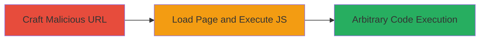

# DOM-based XSS via Unsanitized Iframe Hash

Multi-stage attack chain demonstrating a complete DOM-based XSS workflow targeting a web page that sets iframe sources from unsanitized URL hashes.

## Chain Metrics Dashboard

| Metric | Value |
|--------|-------|
| Chain Status | Unverified |
| Total Steps | 2 |
| Execution Time | ~1 minute |
| Skill Level | Intermediate |
| Complexity | Medium |
| Impact Level | High |

## Attack Flow Visualization

## Prerequisites & Requirements

### Required Tools

- Web browser (e.g., Chrome, Firefox)

### Target Environment

- Web platform
- Client-side JavaScript execution enabled
- Access to the vulnerable page: https://www.exampleframe.html

### Initial Access Requirements

- No credentials required
- Victim must visit the crafted URL (e.g., via phishing or direct link)
- No prior access needed beyond network connectivity

## Detailed Attack Procedures

### Step 1: Craft Malicious URL
procedure: [[procedures/Craft-Malicious-URL-for-DOM-XSS]]

**Objective**: Construct a URL with a javascript: payload in the hash fragment to trigger DOM XSS upon page load.

**Instructions**: Identify the vulnerable page and append a javascript: URI to the hash. For example, use https://www.exampleframe.html#javascript:alert(document.domain) as the payload.

**Expected Output**: A specially crafted URL ready for distribution.

**Success Indicators**:
- URL contains valid javascript: scheme in hash
- No syntax errors in payload

### Step 2: Execute JavaScript via Iframe Hash
procedure: [[procedures/Execute-JavaScript-via-Iframe-Hash]]

**Objective**: Load the malicious URL in the victim's browser to execute arbitrary JavaScript in the page context.

**Instructions**: Direct the victim to visit the crafted URL. The page's JavaScript will extract the hash and set it as the iframe's location without sanitization, executing the payload.

**Expected Output**: Alert box or other JS effects, such as document.domain alert.

**Success Indicators**:
- JavaScript payload executes (e.g., alert fires)
- Potential for further actions like cookie theft

## Attack Chain Summary

### Key Achievements

1. Successful injection of javascript: URI via URL hash
2. Arbitrary JS execution in victim browser context
3. Potential for session hijacking or data exfiltration

## Technique & Tactic Coverage

### MITRE ATT&CK Techniques

- [[JavaScript]]

### MITRE ATT&CK Tactics

- [[Execution]]

---
*Last updated: 2024-01-01T00:00:00Z*
