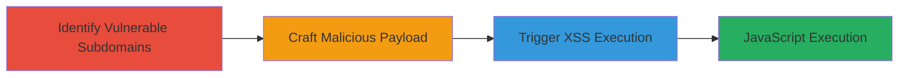

---
tags:
  - xss
  - dom-xss
  - jquery
  - web-vulnerability
type: attack_chain
tools: []
tactics:
  - '[[Execution]]'
verified: false
platforms:
  - Web
submitted: true
complexity: medium
created_at: '2023-10-01T00:00:00Z'
procedures:
  - '[[procedures/Identify-DOM-based-XSS-in-jQuery-location-hash]]'
  - '[[procedures/Craft-XSS-Payload-for-location-hash]]'
  - '[[procedures/Trigger-DOM-based-XSS-via-Malicious-URL]]'
step_count: 3
techniques:
  - '[[JavaScript]]'
updated_at: '2025-12-14T03:47:12.758Z'
description: >-
  Exploits outdated jQuery in Starbucks store subdomains to execute arbitrary
  JavaScript via manipulated location.hash, enabling client-side attacks like
  session hijacking.
skill_level: intermediate
impact_level: medium
id: e5c60a04-22d5-4669-b507-9c910dbafd60
validated: true
mitre_tactics:
  - '[[Execution]]'
mitre_techniques:
  - '[[JavaScript]]'
---
# DOM-based XSS via Unsanitized location.hash in Starbucks Store Subdomains

Multi-stage attack chain demonstrating exploitation of a DOM-based XSS vulnerability in Starbucks store subdomains using outdated jQuery 1.10.1, which inserts unsanitized location.hash into DIV.innerHTML, allowing arbitrary JavaScript execution on page load.

## Chain Metrics Dashboard

| Metric | Value |
|--------|-------|
| Chain Status | Unverified |
| Total Steps | 3 |
| Execution Time | ~5 minutes |
| Skill Level | Intermediate |
| Complexity | Medium |
| Impact Level | Medium |

## Attack Flow Visualization

## Prerequisites & Requirements

### Required Tools

- Web browser (e.g., Chrome or IE 11)

### Target Environment

- Web platform
- Starbucks store subdomains (e.g., store.starbucks.de, store.starbucks.ca)
- Demandware platform with jQuery 1.10.1

### Initial Access Requirements

- Public access to target subdomains
- No credentials required
- Direct network access to the web application

## Detailed Attack Procedures

### Step 1: Identify Vulnerable Subdomains
procedure: [[procedures/Identify-DOM-based-XSS-in-jQuery-location-hash]]

**Objective**: Examine target subdomains to confirm outdated jQuery usage and lack of sanitization in location.hash handling.

**Instructions**: Manually inspect the JavaScript code on store.starbucks.* subdomains (e.g., store.starbucks.de, store.starbucks.ca, store.starbucks.fr, store.starbucks.co.uk) using browser developer tools. Look for jQuery version 1.10.1 and code that processes location.hash by inserting it into DIV.innerHTML without validation.

**Expected Output**: Confirmation of jQuery 1.10.1 and vulnerable code pattern, such as direct assignment to innerHTML.

**Success Indicators**:
- jQuery version identified as 1.10.1
- No sanitization observed in location.hash processing

### Step 2: Craft Malicious Payload
procedure: [[procedures/Craft-XSS-Payload-for-location-hash]]

**Objective**: Create a payload that exploits the innerHTML insertion to inject executable JavaScript.

**Instructions**: Design a payload leveraging jQuery's selector vulnerability, such as `#a.remote[href$=`. Append this to the URL hash of a vulnerable endpoint, e.g., http://store.starbucks.de/on/demandware.store/Sites-StarbucksDE-Site/de_DE/Default-Start#a.remote[href$=.

**Expected Output**: A crafted URL with the malicious hash ready for testing.

**Success Indicators**:
- Payload syntax validated (e.g., via local testing)
- Hash correctly formed to trigger img tag injection

### Step 3: Trigger XSS Execution
procedure: [[procedures/Trigger-DOM-based-XSS-via-Malicious-URL]]

**Objective**: Load the malicious URL to execute the injected JavaScript in the victim's browser context.

**Instructions**: Navigate to the crafted URL in a compatible browser like Chrome or IE 11. The page load will process the hash, insert the payload into innerHTML, and trigger the onerror handler on the img tag, executing alert(document.domain).

**Expected Output**: Alert box displaying the document domain (e.g., store.starbucks.de).

**Success Indicators**:
- JavaScript alert pops up on page load
- Document domain confirmed in alert

## Attack Chain Summary

### Key Achievements

1. Identified and confirmed DOM-based XSS in multiple international Starbucks subdomains.
2. Crafted a reliable payload exploiting jQuery 1.10.1's handling of location.hash.
3. Demonstrated arbitrary JavaScript execution, highlighting risks like session hijacking.

## Technique & Tactic Coverage

### MITRE ATT&CK Techniques

- [[JavaScript]]

### MITRE ATT&CK Tactics

- [[Execution]]

---
*Last updated: 2023-10-01T00:00:00Z*
