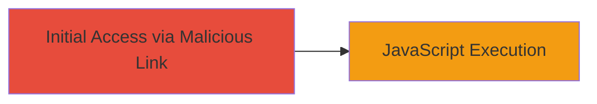

---
tags:
  - xss
  - dom-xss
  - web
  - javascript
type: attack_chain
tools: []
tactics:
  - '[[Execution]]'
verified: false
platforms:
  - Web
submitted: true
complexity: low
created_at: '2023-10-01T00:00:00Z'
procedures:
  - '[[procedures/Inject-Malicious-router_back-Payload-for-DOM-XSS]]'
step_count: 1
techniques:
  - '[[JavaScript]]'
updated_at: '2025-12-14T03:16:08.381Z'
description: >-
  A single-stage attack exploiting a DOM-based XSS vulnerability in the
  router_back parameter of learning.ozon.ru, allowing arbitrary JavaScript
  execution in the victim's browser.
skill_level: novice
impact_level: low
id: 50196f7b-f915-4e75-8a13-73ec82bfb878
validated: true
mitre_tactics:
  - '[[Execution]]'
mitre_techniques:
  - '[[JavaScript]]'
---
# DOM-based XSS via Unsanitized router_back Parameter on learning.ozon.ru

Multi-stage attack chain demonstrating a complete attack workflow.

## Chain Metrics Dashboard

| Metric | Value |
|--------|-------|
| Chain Status | Unverified |
| Total Steps | 1 |
| Execution Time | ~2 minutes |
| Skill Level | Novice |
| Complexity | Low |
| Impact Level | Low |

## Attack Flow Visualization

## Prerequisites & Requirements

### Required Tools

- Browser with developer tools (e.g., Chrome DevTools)

### Target Environment

- Web platform
- Access to learning.ozon.ru subdomain
- No specific ports or services beyond standard HTTPS (443)

### Initial Access Requirements

- Ability to send a malicious link to the victim (e.g., via phishing)
- Victim must click the link while authenticated or in the context of the site
- No prior credentials needed, but session context enhances impact

## Detailed Attack Procedures

### Step 1: Exploit DOM XSS via router_back
procedure: [[procedures/Inject-Malicious-router_back-Payload-for-DOM-XSS]]

**Objective**: Inject a malicious JavaScript payload into the router_back parameter to execute arbitrary code in the victim's browser DOM, potentially leading to session hijacking or data theft.

**Instructions**: Construct a malicious URL by appending a JavaScript payload to the router_back parameter. For example, use a payload like 'javascript:alert(document.cookie)' to test execution. The full URL would be something like 'https://learning.ozon.ru/somepage?router_back=javascript:alert(document.cookie)'. Send this link to the victim via email or social engineering. When the victim clicks it, the parameter is processed without sanitization, manipulating the DOM to execute the JS.

To verify in a testing environment, open the crafted URL in a browser and inspect the DOM using developer tools (F12) to confirm script execution.

**Expected Output**: An alert box or console log displaying sensitive data like cookies, confirming JS execution.

**Success Indicators**:
- JavaScript alert or console output appears in the browser
- DOM inspection shows injected script elements or modified elements
- No server-side errors; execution happens client-side

## Attack Chain Summary

### Key Achievements

1. Successful injection of arbitrary JavaScript via router_back parameter
2. Demonstration of client-side code execution without server interaction
3. Low-severity impact highlighting need for parameter validation

## Technique & Tactic Coverage

### MITRE ATT&CK Techniques

- [[JavaScript]]

### MITRE ATT&CK Tactics

- [[Execution]]

---
*Last updated: 2023-10-01T00:00:00Z*
