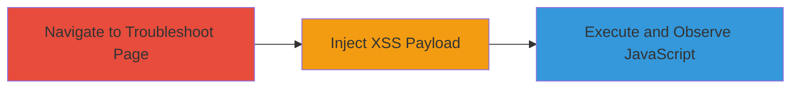

---
id: a1b2c3d4-e5f6-7890-abcd-ef1234567890
name: DOM-based XSS via Username Field Autofocus in DoD Troubleshoot Page
type: attack_chain
description: Exploits a DOM-based XSS vulnerability in the username field of a U.S. Department of Defense web application's troubleshoot page, allowing arbitrary JavaScript execution to steal cookies or hijack sessions.
verified: false
submitted: false
step_count: 3
created_at: 2023-10-01T12:00:00Z
updated_at: 2023-10-01T12:00:00Z
procedures: [[procedures/Inject-DOM-XSS-Payload-into-Username-Field]]
techniques: [[Exploit Public-Facing Application]], [[JavaScript]]
tactics: [[Initial Access]], [[Execution]], [[Collection]]
tags: xss, dom-xss, javascript, web-vulnerability, defense
platforms: Web
tools: []
---

# DOM-based XSS via Username Field Autofocus in DoD Troubleshoot Page

Multi-stage attack chain demonstrating a complete attack workflow.

## Chain Metrics Dashboard

| Metric | Value |
|--------|-------|
| Chain Status | Unverified |
| Total Steps | 3 |
| Execution Time | ~2 minutes |
| Skill Level | Intermediate |
| Complexity | Medium |
| Impact Level | High |

## Attack Flow Visualization

## Prerequisites & Requirements

### Required Tools

- Web browser (e.g., Chrome or Firefox with developer tools)

### Target Environment

- Web platform
- Access to the public-facing DoD web application
- No specific services or ports required beyond standard HTTPS (443)

### Initial Access Requirements

- No credentials required
- Direct network access to the target URL
- No prior access needed; exploitable via unauthenticated navigation

## Detailed Attack Procedures

### Step 1: Navigate to Troubleshoot Page
procedure: [[procedures/Inject-DOM-XSS-Payload-into-Username-Field]]

**Objective**: Access the vulnerable troubleshoot page to prepare for payload injection.

**Instructions**: Open a web browser and navigate to the target URL `https://████/█████████/home/troubleshoot.html?lang=en`. This loads the page containing the username input field susceptible to DOM-based XSS.

**Expected Output**: The troubleshoot page loads, displaying the username input field.

**Success Indicators**:
- Page loads without errors
- Username input field is visible and interactive

### Step 2: Inject Payload into Username Field
procedure: [[procedures/Inject-DOM-XSS-Payload-into-Username-Field]]

**Objective**: Deliver the crafted XSS payload to trigger DOM manipulation and JavaScript execution.

**Instructions**: In the username input field, enter the payload `1--><button/autofocus/onfocus=Function("confirm`1`")();//`. This payload closes the input tag, injects a button element with autofocus and onfocus attributes, and executes arbitrary JavaScript upon focus.

**Expected Output**: The payload is accepted without sanitization, altering the DOM to include the malicious button.

**Success Indicators**:
- No input validation errors
- DOM inspection (via browser dev tools) shows the injected button element

### Step 3: Observe JavaScript Execution
procedure: [[procedures/Inject-DOM-XSS-Payload-into-Username-Field]]

**Objective**: Trigger and verify the execution of arbitrary JavaScript, confirming the XSS vulnerability.

**Instructions**: Interact with the page to cause autofocus on the injected button, such as by submitting the form or clicking nearby. The onfocus event will execute `Function("confirm`1`")()`, displaying a confirmation dialog.

**Expected Output**: A browser confirmation dialog appears with the message "1", indicating successful JavaScript execution.

**Success Indicators**:
- Confirmation dialog pops up
- Browser console logs any errors or confirms execution without blocks

## Attack Chain Summary

### Key Achievements

1. Successful navigation to the vulnerable troubleshoot page without authentication.
2. Injection of a DOM-based XSS payload bypassing client-side sanitization.
3. Arbitrary JavaScript execution, enabling potential session theft or redirection.

## Technique & Tactic Coverage

### MITRE ATT&CK Techniques

- [[Exploit Public-Facing Application]] Exploit Public-Facing Application
- [[JavaScript]] JavaScript

### MITRE ATT&CK Tactics

- [[Initial Access]] Initial Access
- [[Execution]] Execution
- [[Collection]] Collection

---
*Last updated: 2023-10-01T12:00:00Z*
