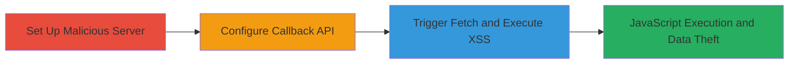

---
tags:
  - xss
  - dom-xss
  - web-vulnerability
  - callback-api
type: attack_chain
tools: []
tactics:
  - '[[Execution]]'
  - '[[Collection]]'
verified: false
platforms:
  - Web
submitted: true
complexity: medium
created_at: '2023-10-01T00:00:00Z'
procedures:
  - '[[procedures/Set-Up-Malicious-Server-with-XSS-Payload]]'
  - '[[procedures/Configure-VK-Community-Callback-API]]'
  - '[[procedures/Trigger-Callback-Fetch-and-XSS-Execution]]'
step_count: 3
techniques:
  - '[[JavaScript]]'
updated_at: '2025-12-13T23:52:25.582Z'
description: >-
  Multi-stage attack exploiting a DOM-based XSS vulnerability in VK.com's
  community callback API by hosting a malicious payload on a controlled server
  and configuring the API to fetch and display it unsanitized.
skill_level: intermediate
impact_level: high
id: cde687cf-4cec-45b5-a7b2-dcacbae65a84
validated: true
mitre_tactics:
  - '[[Execution]]'
  - '[[Collection]]'
mitre_techniques:
  - '[[JavaScript]]'
---
# DOM-based XSS via VK.com Community Callback API

Multi-stage attack chain demonstrating exploitation of a DOM-based Cross-Site Scripting (XSS) vulnerability in VK.com's callback API for communities. The attack involves setting up a malicious server, configuring the community settings to use it as a callback endpoint, and triggering VK to fetch and render the unsanitized response, leading to arbitrary JavaScript execution in the context of the community page.

## Chain Metrics Dashboard

| Metric | Value |
|--------|-------|
| Chain Status | Unverified |
| Total Steps | 3 |
| Execution Time | ~5 minutes |
| Skill Level | Intermediate |
| Complexity | Medium |
| Impact Level | High |

## Attack Flow Visualization



## Prerequisites & Requirements

### Required Tools

- None specified (requires a basic web server setup, e.g., Python's http.server or Node.js)

### Target Environment

- VK.com community page with admin access
- Web browser for configuration and observation
- Network access to host a public server

### Initial Access Requirements

- Administrative access to a VK.com community
- Ability to host a public server (e.g., via ngrok for local testing or a VPS)
- No prior credentials on VK.com beyond community admin

## Detailed Attack Procedures

### Step 1: Set Up Malicious Server
procedure: [[procedures/Set-Up-Malicious-Server-with-XSS-Payload]]

**Objective**: Host a server that returns an XSS payload to be fetched by VK.com's callback API.

**Instructions**: Create and start a simple web server responding with a malicious payload, such as a script tag executing JavaScript (e.g., alert or data exfiltration). Use a tool like Python's built-in server for quick setup.

For example, create an `index.html` file with:

```html
<script>alert('XSS Executed');</script>
```

Then serve it:

```bash
python3 -m http.server 8000
```

Expose it publicly if needed (e.g., using ngrok: `ngrok http 8000` to get a public URL).

**Expected Output**: Server running and accessible via URL, returning the payload on GET requests.

**Success Indicators**:
- Server logs show responses with the payload
- Direct browser access to the URL displays the script

### Step 2: Configure Callback API
procedure: [[procedures/Configure-VK-Community-Callback-API]]

**Objective**: Point the VK.com community callback API to the malicious server endpoint.

**Instructions**: Log in to VK.com as community admin, navigate to community settings, and set the callback URL to the malicious server's public endpoint (e.g., `https://your-server.com/callback`).

In the VK community management interface:
1. Go to "Settings" > "API Settings" or similar section for callbacks.
2. Enter the callback URL pointing to your server.
3. Save the configuration.

**Expected Output**: Configuration saved without errors; VK.com acknowledges the new callback URL.

**Success Indicators**:
- Callback URL updated in community settings
- No validation errors from VK.com

### Step 3: Trigger and Observe Execution
procedure: [[procedures/Trigger-Callback-Fetch-and-XSS-Execution]]

**Objective**: Cause VK.com to fetch the callback response and render it, executing the XSS payload.

**Instructions**: Perform an action in the community that triggers the callback API (e.g., posting an update or event that invokes the callback). Observe the response screen where VK displays the fetched data.

VK.com will send a request to your server, receive the payload, and insert it into the DOM without sanitization, leading to execution.

Monitor your server logs for the incoming request from VK.com.

**Expected Output**: JavaScript alert or console log on the VK community page; potential data theft if payload is modified (e.g., sending cookies to an attacker server).

**Success Indicators**:
- Server receives request from VK.com IP/domain
- XSS payload executes (e.g., alert pops up) on the callback response screen
- No sanitization observed in the rendered response

## Attack Chain Summary

### Key Achievements

1. Successful setup of a malicious callback server delivering XSS payload
2. Configuration of VK.com community to use the malicious endpoint
3. Execution of arbitrary JavaScript in the authenticated community context, enabling session hijacking or data theft

## Technique & Tactic Coverage

### MITRE ATT&CK Techniques

- [[JavaScript]]

### MITRE ATT&CK Tactics

- [[Execution]]
- [[Collection]]

---

*Last updated: 2023-10-01T00:00:00Z*
