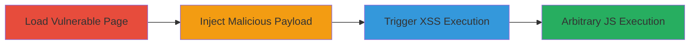

---
tags:
  - xss
  - dom-xss
  - postmessage
  - reveal.js
  - javascript
type: attack_chain
tools: []
tactics:
  - '[[Execution]]'
verified: false
platforms:
  - Web
submitted: true
complexity: medium
created_at: '2023-10-01T00:00:00Z'
procedures:
  - '[[procedures/Load-Vulnerable-reveal.js-Page]]'
  - '[[procedures/Inject-Malicious-Key-Binding-via-postMessage]]'
  - '[[procedures/Trigger-XSS-via-toggleHelp]]'
step_count: 3
techniques:
  - '[[JavaScript]]'
updated_at: '2025-12-14T03:16:20.222Z'
description: >-
  Multi-stage attack exploiting DOM-based XSS in reveal.js 3.8.0 by injecting
  malicious key bindings via postMessage and triggering execution through the
  help modal.
skill_level: intermediate
impact_level: high
id: dfb63338-757c-42e8-a4af-3afa5eee60d6
validated: true
mitre_tactics:
  - '[[Execution]]'
mitre_techniques:
  - '[[JavaScript]]'
---
# DOM-based XSS via postMessage API in reveal.js

Multi-stage attack chain demonstrating exploitation of a DOM-based XSS vulnerability in reveal.js version 3.8.0. An attacker can send postMessage events from any origin to invoke arbitrary Reveal methods, injecting malicious payloads into key bindings that are later rendered unescaped in the help modal, leading to arbitrary JavaScript execution in the victim's browser context.

## Chain Metrics Dashboard

| Metric | Value |
|--------|-------|
| Chain Status | Unverified |
| Total Steps | 3 |
| Execution Time | ~1 minutes |
| Skill Level | Intermediate |
| Complexity | Medium |
| Impact Level | High |

## Attack Flow Visualization

## Prerequisites & Requirements

### Required Tools

- Browser developer console or JavaScript execution environment

### Target Environment

- Web platform with reveal.js 3.8.0 loaded (e.g., https://revealjs.com)
- No specific services/ports required beyond HTTP/HTTPS access
- Attacker needs ability to load the page in an iframe or new window

### Initial Access Requirements

- No credentials needed
- Same-origin or cross-origin access to embed or open the reveal.js page
- JavaScript execution in attacker's context

## Detailed Attack Procedures

### Step 1: Load Vulnerable reveal.js Page
procedure: [[procedures/Load-Vulnerable-reveal.js-Page]]

**Objective**: Embed or open the vulnerable reveal.js presentation to establish a target frame or window for postMessage attacks.

**Instructions**: Use an iframe to embed the reveal.js page or open it in a new window, ensuring the page loads completely before proceeding.

**Expected Output**: The reveal.js presentation is loaded and ready for postMessage interactions.

**Success Indicators**:
- Page loads without errors
- Reveal object is accessible in the target context

### Step 2: Inject Malicious Key Binding via postMessage
procedure: [[procedures/Inject-Malicious-Key-Binding-via-postMessage]]

**Objective**: Send a postMessage to add a key binding with an XSS payload in its description, which will be stored in the registeredKeyBindings array without sanitization.

**Instructions**: From the attacker's page, target the iframe or window and execute the postMessage command to invoke addKeyBinding with the malicious args.

**Expected Output**: The key binding is added to the array, setting up the payload for later rendering.

**Success Indicators**:
- No errors from postMessage
- Key binding registered (verifiable via console inspection)

### Step 3: Trigger XSS via toggleHelp
procedure: [[procedures/Trigger-XSS-via-toggleHelp]]

**Objective**: Invoke toggleHelp to render the help modal, which displays the injected key bindings as unescaped HTML, executing the XSS payload.

**Instructions**: Send another postMessage to call toggleHelp on the Reveal object, causing the help table to render and trigger the onerror alert.

**Expected Output**: Alert box pops up with the document domain, confirming XSS execution.

**Success Indicators**:
- Help modal appears
- JavaScript alert executes, indicating arbitrary code run

## Attack Chain Summary

### Key Achievements

1. Bypassed origin restrictions via unvalidated postMessage listener
2. Injected and persisted XSS payload in key bindings
3. Achieved arbitrary JavaScript execution in victim context, enabling account access or actions on behalf

## Technique & Tactic Coverage

### MITRE ATT&CK Techniques

- [[JavaScript]]

### MITRE ATT&CK Tactics

- [[Execution]]

---
*Last updated: 2023-10-01T00:00:00Z*
