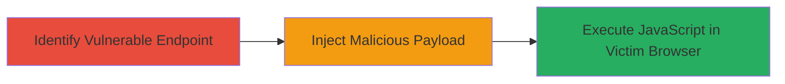

---
tags:
  - xss
  - dom-xss
  - javascript
  - web-vulnerability
type: attack_chain
tools: []
tactics:
  - '[[Execution]]'
  - '[[Collection]]'
verified: false
platforms:
  - Web
submitted: true
created_at: '2023-10-01T00:00:00Z'
procedures:
  - '[[procedures/Exploit-DOM-based-XSS-in-returnUrl-Parameter]]'
step_count: 2
techniques:
  - '[[JavaScript]]'
  - '[[Exploit Public-Facing Application]]'
updated_at: '2025-12-14T03:16:08.488Z'
description: >-
  A multi-stage attack exploiting a DOM-based XSS vulnerability in the returnUrl
  parameter of the GTA Online news article endpoint, allowing arbitrary
  JavaScript execution in victims' browsers on localized versions of the site.
id: 9050fb1f-4885-41f6-abe7-4a827622adbd
validated: true
mitre_tactics:
  - '[[Execution]]'
  - '[[Collection]]'
mitre_techniques:
  - '[[JavaScript]]'
  - '[[Exploit Public-Facing Application]]'
---
# DOM-based XSS via returnUrl Parameter on GTA Online Localized Site

Multi-stage attack chain demonstrating exploitation of a DOM-based XSS vulnerability in the 'returnUrl' parameter on localized GTA Online screenshot sites, such as the German version at https://www.rockstargames.com/GTAOnline/de/screens/. This allows attackers to inject and execute arbitrary JavaScript in the victim's browser context, potentially leading to session hijacking or data theft.

## Chain Metrics Dashboard

| Metric | Value |
|--------|-------|
| Chain Status | Unverified |
| Total Steps | 2 |
| Execution Time | ~5 minutes |
| Skill Level | Intermediate |
| Complexity | Medium |
| Impact Level | Medium |

## Attack Flow Visualization

## Prerequisites & Requirements

### Required Tools

- Web browser with developer tools (e.g., Chrome DevTools)
- Optional: Proxy tool like Burp Suite for payload crafting

### Target Environment

- Web platform
- JavaScript-enabled client-side rendering
- Access to localized GTA Online sites (e.g., /de/, /jp/ paths)

### Initial Access Requirements

- Public internet access to the target site
- No authentication required for the news/article endpoint
- Victim interaction needed (e.g., clicking a crafted link)

## Detailed Attack Procedures

### Step 1: Identify Vulnerable Endpoint

procedure: [[procedures/Exploit-DOM-based-XSS-in-returnUrl-Parameter]]

**Objective**: Locate the news/article endpoint on a localized GTA Online site and confirm the returnUrl parameter is processed client-side without proper sanitization.

**Instructions**: Navigate to a localized version of the site, such as https://www.rockstargames.com/GTAOnline/de/screens/, and inspect the URL structure for news/article paths. Use browser developer tools to monitor network requests and DOM manipulations when parameters are appended.

**Expected Output**: Confirmation that the /GTAOnline/de/news/article endpoint accepts and reflects the returnUrl parameter in client-side JavaScript.

**Success Indicators**:
- Endpoint responds without server-side errors
- returnUrl value appears in DOM or JavaScript execution trace

### Step 2: Inject and Execute Malicious Payload

procedure: [[procedures/Exploit-DOM-based-XSS-in-returnUrl-Parameter]]

**Objective**: Craft and deliver a malicious returnUrl payload to inject arbitrary JavaScript, executing in the victim's browser for potential data exfiltration or session manipulation.

**Instructions**: Construct a URL with a payload in the returnUrl parameter, such as https://www.rockstargames.com/GTAOnline/de/news/article?returnUrl=javascript:alert('XSS'). Deliver via phishing or social engineering to trick the victim into visiting. Monitor execution using developer tools console for alert or script output.

**Expected Output**: Arbitrary JavaScript executes, e.g., an alert box pops up or network requests are made from the victim's browser.

**Success Indicators**:
- JavaScript payload executes without errors
- Victim's session cookies or local data can be accessed via console

## Attack Chain Summary

### Key Achievements

1. Identified client-side vulnerability in URL parameter handling
2. Injected and executed JavaScript in authenticated user context
3. Demonstrated potential for medium-impact attacks like session hijacking

## Technique & Tactic Coverage

### MITRE ATT&CK Techniques

- [[JavaScript]]
- [[Exploit Public-Facing Application]]

### MITRE ATT&CK Tactics

- [[Execution]]
- [[Collection]]

---
*Last updated: 2023-10-01T00:00:00Z*
