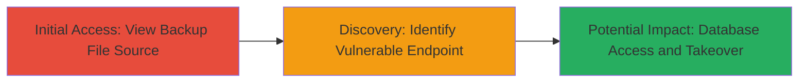

# Database Credentials Exposure via Public PHP Backup File Enabling Potential Domain Takeover

Multi-stage attack chain demonstrating the discovery and exploitation of sensitive information disclosure in a public web application, leading to potential unauthorized access and domain takeover.

## Chain Metrics Dashboard

| Metric | Value |
|--------|-------|
| Chain Status | Unverified |
| Total Steps | 2 |
| Execution Time | ~2 minutes |
| Skill Level | Beginner |
| Complexity | Low |
| Impact Level | High |

## Attack Flow Visualization



## Prerequisites & Requirements

### Required Tools

- Web browser (e.g., Chrome, Firefox)
- Optional: [[tools/curl]]

### Target Environment

- Web platform with PHP applications
- Publicly accessible HTTP/HTTPS services
- No authentication required for initial access

### Initial Access Requirements

- Internet access to the target domain
- No prior credentials needed
- Basic knowledge of web browsing and URL manipulation

## Detailed Attack Procedures

### Step 1: Access Backup File to Extract Credentials
procedure: [[procedures/View-Source-of-PHP-Backup-File-to-Extract-Credentials]]

**Objective**: Reveal and extract hardcoded database credentials from a publicly viewable PHP backup file.

**Instructions**: Navigate to the suspected backup file URL in a web browser. Right-click and select "View Page Source" or use developer tools to inspect the raw content. Look for variables containing connection details such as hostname, database name, username, and password.

Alternatively, use curl to fetch the content:

```bash
curl https://██████████.edu/database.php.orig
```

Grep for credential patterns:

```bash
curl https://██████████.edu/database.php.orig | grep -E 'hostname|db|username|password'
```

**Expected Output**: Plain text PHP code displaying variables like `$hostname = '████████.edu'; $db = '█████████'; $username = '████_user'; $password = '████';`.

**Success Indicators**:
- Credential variables visible in source
- No errors or redirects blocking access

### Step 2: Identify Vulnerable Endpoint for Manipulation
procedure: [[procedures/Identify-Installation-Endpoint-for-Database-Manipulation]]

**Objective**: Locate an active installation script that allows unauthorized database updates, enabling potential domain takeover.

**Instructions**: Append common installation paths to the target domain, such as `/install.php?step=1`. Access the URL in a browser to check for functionality. Observe if the page loads without authentication and allows form submissions or parameter manipulations that could update database records.

Use curl to probe:

```bash
curl 'https://███.edu/install.php?step=1'
```

Inspect the response for editable fields or error messages indicating database interaction.

**Expected Output**: Page content showing installation steps or database configuration forms without login prompts.

**Success Indicators**:
- Endpoint responds without authentication
- Indications of database write capabilities (e.g., forms for updates)

## Attack Chain Summary

### Key Achievements

1. Successful extraction of database credentials from public backup file
2. Identification of unprotected installation endpoint
3. Potential for unauthorized database access and domain control

## Technique & Tactic Coverage

### MITRE ATT&CK Techniques

- [[Exploit Public-Facing Application]] Exploit Public-Facing Application
- [[File and Directory Discovery]] File and Directory Discovery
- [[Credentials In Files]] Credentials In Files

### MITRE ATT&CK Tactics

- [[Initial Access]] Initial Access
- [[Discovery]] Discovery
- [[Credential Access]] Credential Access

---
*Last updated: 2023-10-01T00:00:00Z*
