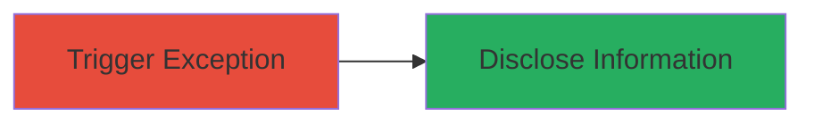

---
tags:
  - information-disclosure
  - debug-leak
  - sinatra
  - oauth
  - web-vulnerability
type: attack_chain
tools: []
tactics:
  - '[[Reconnaissance]]'
verified: false
platforms:
  - Web
submitted: true
complexity: low
created_at: '2024-10-01T00:00:00Z'
procedures:
  - '[[procedures/Trigger-Exception-to-Disclose-Debug-Information]]'
step_count: 1
techniques:
  - '[[Gather Victim Host Information]]'
updated_at: '2025-12-14T17:25:13.218Z'
description: >-
  An attack chain demonstrating information disclosure through triggering an
  unhandled exception in a Sintra-based OAuth redirector service, exposing
  internal configuration, environment variables, and source code snippets.
skill_level: beginner
impact_level: medium
id: 9ac2b033-8a0d-4109-a3fc-e696838e9949
validated: true
mitre_tactics:
  - '[[Reconnaissance]]'
mitre_techniques:
  - '[[Gather Victim Host Information]]'
---
# Debug Information Disclosure via Unhandled Exception in Sintra Framework

Multi-stage attack chain demonstrating a complete attack workflow.

## Chain Metrics Dashboard

| Metric | Value |
|--------|-------|
| Chain Status | Unverified |
| Total Steps | 1 |
| Execution Time | ~1 minutes |
| Skill Level | Beginner |
| Complexity | Low |
| Impact Level | Medium |

## Attack Flow Visualization



## Prerequisites & Requirements

### Required Tools

- None (standard HTTP client like curl or browser developer tools)

### Target Environment

- Web platform
- OAuth services on port 443 (HTTPS)
- Sintra (Sinatra) framework application

### Initial Access Requirements

- Public network access to the target endpoint
- No credentials required
- Ability to send custom HTTP requests with cookies

## Detailed Attack Procedures

### Step 1: Trigger Exception for Information Disclosure
procedure: [[procedures/Trigger-Exception-to-Disclose-Debug-Information]]

**Objective**: Send an invalid OAuth redirect URI cookie to the target endpoint to trigger an unhandled exception, causing the Sintra framework to disclose debug information including internal configuration, environment variables, and source code snippets.

**Instructions**: Use [[commands/send-invalid-oauth-redirect-request]] to craft and send the HTTP GET request:

```bash
curl -X GET "https://oauth-redirector.services.greenhouse.io/integrations/oauth/create?state=x&code=x" -H "Cookie: oauth_redirect_uri=https%3A%2F%2Fapp.greenhouse.io%2Fusers%2Fauth%2Fgoogle_oauth2%2Fcallback"
```

This request uses an invalid oauth_redirect_uri value (pointing to a non-existent or malformed callback URL) to force an exception during OAuth processing.

**Expected Output**: An HTML error page displaying detailed exception information, including Ruby/Sintra stack traces, environment variables (e.g., database credentials, API keys), application configuration details, and snippets of source code from the affected endpoint.

**Success Indicators**:
- Presence of show_exceptions debug output in the response
- Exposure of sensitive data like env vars or config files
- Stack trace revealing internal paths or framework details

## Attack Chain Summary

### Key Achievements

1. Successful triggering of unhandled exception without authentication
2. Disclosure of sensitive internal application data aiding reconnaissance
3. Identification of potential further attack vectors from leaked information

## Technique & Tactic Coverage

### MITRE ATT&CK Techniques

- [[Gather Victim Host Information]]

### MITRE ATT&CK Tactics

- [[Reconnaissance]]

---

*Last updated: 2024-10-01T00:00:00Z*
