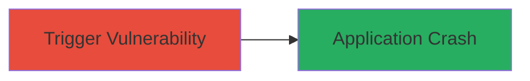

# Denial of Service Crash via Code Injection in PHP locale_get_keywords Function

Multi-stage attack chain demonstrating a complete attack workflow.

## Chain Metrics Dashboard

| Metric | Value |
|--------|-------|
| Chain Status | Unverified |
| Total Steps | 1 |
| Execution Time | ~1 minute |
| Skill Level | Intermediate |
| Complexity | Low |
| Impact Level | Low |

## Attack Flow Visualization



## Prerequisites & Requirements

### Required Tools

- None required (uses native PHP execution)

### Target Environment

- PHP runtime environment (version affected by bug #73371)
- Access to execute PHP code, such as a web server or CLI
- No specific services/ports required beyond PHP execution

### Initial Access Requirements

- Code execution privileges on the target PHP application
- Ability to invoke internal PHP functions like locale_get_keywords
- No prior network access needed if local; remote if web-exposed

## Detailed Attack Procedures

### Step 1: Trigger the Crash
procedure: [[procedures/Trigger-PHP-locale_get_keywords-Crash]]

**Objective**: Exploit improper handling in the locale_get_keywords function to cause a crash and denial of service.

**Instructions**: Prepare a PHP script that calls the locale_get_keywords function with a malformed or invalid locale string to trigger the code injection and subsequent crash. For example, in a controlled test environment:

```php
<?php
// Example invocation with potentially malformed input
$keywords = locale_get_keywords('invalid_locale_string');
print_r($keywords);
?>
```

Execute the script via PHP CLI or embed in a web application to observe the crash.

**Expected Output**: The PHP process crashes, resulting in a segmentation fault or abrupt termination, leading to denial of service.

**Success Indicators**:
- PHP application or process terminates unexpectedly
- Error logs show crash related to locale_get_keywords (e.g., segfault in bug #73371)
- No further responses from the affected PHP instance

## Attack Chain Summary

### Key Achievements

1. Successful invocation of vulnerable function leading to crash
2. Demonstration of denial of service impact on PHP runtime
3. Identification of code injection vector in locale handling

## Technique & Tactic Coverage

### MITRE ATT&CK Techniques

- [[Endpoint Denial of Service]]
- [[Exploit Public-Facing Application]]

### MITRE ATT&CK Tactics

- [[Impact]]

---
*Last updated: 2023-10-01T12:00:00Z*
