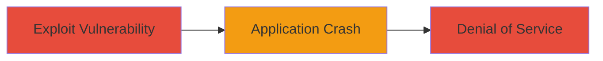

# Denial of Service via Code Injection in PHP locale_compose() Function

Multi-stage attack chain demonstrating a complete attack workflow targeting a code injection vulnerability in PHP's locale_compose() function, leading to application crashes and denial of service.

## Chain Metrics Dashboard

| Metric | Value |
|--------|-------|
| Chain Status | Unverified |
| Total Steps | 1 |
| Execution Time | ~1 minute |
| Skill Level | Intermediate |
| Complexity | Low |
| Impact Level | Low |

## Attack Flow Visualization



## Prerequisites & Requirements

### Required Tools

- None specific; uses standard HTTP client like curl.

### Target Environment

- PHP-based web application using locale_compose() function.
- Web platform with exposed endpoints calling the vulnerable function.
- No specific ports required beyond standard HTTP/HTTPS (80/443).

### Initial Access Requirements

- Network access to the target web application.
- No credentials needed; vulnerability is unauthenticated.
- Ability to send crafted HTTP requests.

## Detailed Attack Procedures

### Step 1: Trigger Code Injection Crash
procedure: [[procedures/Exploit-Code-Injection-in-locale_compose-for-DoS]]

**Objective**: Send malicious input to the locale_compose() function to inject code and cause an application crash, resulting in denial of service.

**Instructions**: Identify an endpoint in the PHP application that invokes locale_compose() with user-controlled input, such as a locale selection parameter. Craft a request with injection payload that exploits the unspecified implementation flaw (e.g., malformed locale string leading to code execution and crash). Use a tool like curl to send the request:

```bash
curl -X POST 'http://target.com/set-locale' -d 'locale=malicious_payload_here' -v
```

Monitor the server response and logs for crash indicators, such as HTTP 500 errors or process termination.

**Expected Output**: Server returns an error (e.g., 500 Internal Server Error) and the application crashes, making it unavailable until restart.

**Success Indicators**:
- Application becomes unresponsive.
- Server logs show PHP fatal error or segmentation fault related to locale_compose().
- No further requests can be processed until service restart.

## Attack Chain Summary

### Key Achievements

1. Successful injection into locale_compose() causing immediate crash.
2. Achieved denial of service without requiring authentication or escalation.
3. Demonstrated low-severity impact focused on availability disruption.

## Technique & Tactic Coverage

### MITRE ATT&CK Techniques

- [[Endpoint Denial of Service]] Endpoint Denial of Service
- [[Python]] PHP

### MITRE ATT&CK Tactics

- [[Impact]] Impact

---
*Last updated: 2023-10-01T00:00:00Z*
