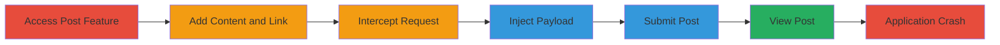

---
tags:
  - dom-clobbering
  - html-injection
  - dos
  - phishing
  - slack
type: attack_chain
tools:
  - '[[tools/Burp-Suite]]'
tactics:
  - '[[Impact]]'
verified: false
platforms:
  - Web
  - Desktop
  - Mobile
submitted: true
complexity: medium
created_at: '2023-10-01T00:00:00Z'
procedures:
  - '[[procedures/Prepare-Slack-Post-with-Hyperlink]]'
  - '[[procedures/Intercept-and-Modify-Request-with-Burp-Suite]]'
  - '[[procedures/Submit-Malicious-Post-in-Slack]]'
  - '[[procedures/Trigger-DOS-by-Viewing-Post]]'
step_count: 7
techniques:
  - '[[Endpoint Denial of Service]]'
  - '[[Drive-by Compromise]]'
updated_at: '2025-12-14T17:26:56.273Z'
description: >-
  A multi-stage attack exploiting HTML injection in Slack's hyperlink creation
  to perform DOM clobbering, overriding document methods and causing application
  crashes across web, desktop, and mobile platforms, with potential for phishing
  on mobile.
skill_level: intermediate
impact_level: high
id: ed0cb0d1-93e8-4875-aeea-f0a58dee296f
validated: true
mitre_tactics:
  - '[[Impact]]'
mitre_techniques:
  - '[[Endpoint Denial of Service]]'
  - '[[Drive-by Compromise]]'
---
# Denial of Service via DOM Clobbering in Slack Hyperlinks

Multi-stage attack chain demonstrating a complete attack workflow exploiting insufficient sanitization in Slack's hyperlink feature to inject HTML elements that clobber document object properties, leading to JavaScript errors and application crashes when the post is rendered. The attack requires intercepting a POST request to inject a payload with named elements like  to override methods such as document.write and createElement, causing denial of service across platforms. On mobile, it enables potential phishing via injected iframes that activate on user interaction.

## Chain Metrics Dashboard

| Metric | Value |
|--------|-------|
| Chain Status | Unverified |
| Total Steps | 7 |
| Execution Time | ~5 minutes |
| Skill Level | Intermediate |
| Complexity | Medium |
| Impact Level | High |

## Attack Flow Visualization

## Prerequisites & Requirements

### Required Tools

- [[tools/Burp-Suite]]

### Target Environment

- Slack application (web, desktop, or mobile client)
- Access to a Slack workspace with post creation permissions
- Network access to intercept HTTP requests (e.g., via proxy)

### Initial Access Requirements

- Valid Slack account with permission to create and share posts in channels or DMs
- No elevated privileges required
- Attacker must be able to intercept traffic from their own Slack client

## Detailed Attack Procedures

### Step 1: Access the Create Post Feature
procedure: [[procedures/Prepare-Slack-Post-with-Hyperlink]]

**Objective**: Navigate to the post creation interface in Slack to begin crafting the malicious post.

**Instructions**: Open the Slack application (web, desktop, or mobile) and select a channel or direct message where you have posting permissions. Click the compose button to enter the post editor.

**Expected Output**: Post creation interface is open and ready for input.

**Success Indicators**:
- Post editor is visible
- No errors in accessing the interface

### Step 2: Add Title and Content to the Post
procedure: [[procedures/Prepare-Slack-Post-with-Hyperlink]]

**Objective**: Enter arbitrary content to set up the hyperlink injection point.

**Instructions**: Type any title and text content into the post editor. For example, enter "Test Post" as the title and some sample text like "Check this link: " followed by selected text to link.

**Expected Output**: Content is entered in the editor without issues.

**Success Indicators**:
- Text is visible in the editor
- Editor accepts input normally

### Step 3: Select Content and Invoke the Create Link Feature
procedure: [[procedures/Prepare-Slack-Post-with-Hyperlink]]

**Objective**: Highlight text to prepare for hyperlink insertion, opening the link dialog.

**Instructions**: Highlight the text intended for the link (e.g., "this link"), then click the link icon in the editor toolbar or use the context menu to open the hyperlink dialog.

**Expected Output**: Link dialog appears, prompting for a URL.

**Success Indicators**:
- Text is selected
- Link dialog is open

### Step 4: Enter a Benign Link URL Initially
procedure: [[procedures/Prepare-Slack-Post-with-Hyperlink]]

**Objective**: Input a placeholder URL to trigger the POST request for interception.

**Instructions**: In the link dialog, enter a harmless URL such as "https://example.com" and click OK to proceed with submission.

**Expected Output**: The link is temporarily added to the post, and Slack prepares to send the POST request.

**Success Indicators**:
- Placeholder link appears in the editor
- No immediate errors

### Step 5: Intercept the Request with Burp Suite and Modify the Link Property
procedure: [[procedures/Intercept-and-Modify-Request-with-Burp-Suite]]

**Objective**: Capture the outgoing POST request and replace the link parameter with a DOM clobbering payload.

**Instructions**: Ensure Burp Suite is configured as a proxy for your browser or Slack client. When the request is intercepted, locate the 'link' parameter in the POST body. Replace its value with a malicious payload, such as: "https://example.com">...<" (extend with names for other document methods like open, close, etc., to maximize clobbering).

**Expected Output**: Modified request shows the injected HTML elements in the link parameter.

**Success Indicators**:
- Request is successfully intercepted
- Payload is injected without syntax errors in Burp

### Step 6: Forward the Modified Request and Share the Post
procedure: [[procedures/Submit-Malicious-Post-in-Slack]]

**Objective**: Submit the altered post to a channel or DM.

**Instructions**: In Burp Suite, forward the modified request to complete the submission. Then, in Slack, share or post the content to the target channel or direct message.

**Expected Output**: Post is created and visible in the channel or DM, but appears normal until rendered.

**Success Indicators**:
- Post submission succeeds
- No immediate crash on submission

### Step 7: View the Post in the Channel or Direct Message
procedure: [[procedures/Trigger-DOS-by-Viewing-Post]]

**Objective**: Render the post to activate DOM clobbering, overriding document functions and triggering JavaScript errors that crash the application.

**Instructions**: Navigate to the channel or DM containing the post and view it. On mobile, interact if needed for iframe phishing (e.g., click injected elements).

**Expected Output**: Application crashes due to JS errors from clobbered methods; on mobile, potential iframe loads external phishing content.

**Success Indicators**:
- JavaScript errors in console (web/desktop)
- Application freeze or crash
- On mobile: Phishing site loads upon interaction

## Attack Chain Summary

### Key Achievements

1. Successful HTML injection via unsanitized hyperlink parameter
2. DOM clobbering of critical document methods leading to DoS
3. Cross-platform impact including phishing potential on mobile

## Technique & Tactic Coverage

### MITRE ATT&CK Techniques

- [[Endpoint Denial of Service]] Endpoint Denial of Service
- [[Drive-by Compromise]] Drive-by Compromise

### MITRE ATT&CK Tactics

- [[Impact]] Impact

---
*Last updated: 2023-10-01T00:00:00Z*
