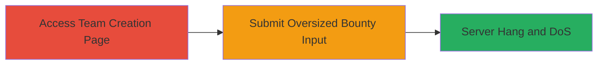

---
tags:
  - dos
  - resource-exhaustion
  - input-validation
  - web
type: attack_chain
tools: []
tactics:
  - '[[Impact]]'
verified: false
platforms:
  - Web
submitted: true
complexity: low
created_at: '2023-10-01T00:00:00Z'
procedures:
  - '[[procedures/Submit-Oversized-Bounty-Value-to-Trigger-Server-Hang]]'
step_count: 1
techniques:
  - '[[Endpoint Denial of Service]]'
updated_at: '2025-12-14T17:26:37.178Z'
description: >-
  A single-step attack exploiting uncontrolled resource consumption in the
  HackerOne team creation form by submitting an oversized bounty value, leading
  to temporary website denial of service.
skill_level: beginner
impact_level: medium
id: 13307480-b283-4f2f-b86e-7805fef3400c
validated: true
mitre_tactics:
  - '[[Impact]]'
mitre_techniques:
  - '[[Endpoint Denial of Service]]'
---
# Denial of Service via Excessive Bounty Input on HackerOne Team Creation

Multi-stage attack chain demonstrating a complete attack workflow.

## Chain Metrics Dashboard

| Metric | Value |
|--------|-------|
| Chain Status | Unverified |
| Total Steps | 1 |
| Execution Time | ~1.5 minutes |
| Skill Level | Beginner |
| Complexity | Low |
| Impact Level | Medium |

## Attack Flow Visualization

## Prerequisites & Requirements

### Required Tools

- Web browser (e.g., Chrome, Firefox)

### Target Environment

- Web platform
- Access to public-facing HackerOne team creation page
- No authentication required for initial access

### Initial Access Requirements

- Internet connectivity
- No credentials needed
- Direct network access to hackerone.com

## Detailed Attack Procedures

### Step 1: Submit Oversized Input
procedure: [[procedures/Submit-Oversized-Bounty-Value-to-Trigger-Server-Hang]]

**Objective**: Exploit the lack of input validation on the bounty field to cause excessive server-side processing, resulting in a temporary denial of service.

**Instructions**: Navigate to the team creation page and input an extremely large bounty value (over 1,000,000 digits) in the bounty field before submitting the form. This can be done manually via a web browser or using a tool like curl to POST the oversized data.

For manual execution:
1. Open a web browser and go to https://hackerone.com/teams/new.
2. Fill in the team creation form, but in the bounty amount field, paste or generate a string of over 1,000,000 digits (e.g., a repeated '1' character).
3. Submit the form.

**Expected Output**: The website will hang and become unresponsive for approximately 1.5 minutes, after which an error page may display.

**Success Indicators**:
- Website responsiveness halts immediately after submission
- Server processing delay observed (e.g., loading spinner persists)
- Error page appears after the hang period

## Attack Chain Summary

### Key Achievements

1. Successful triggering of server-side resource exhaustion
2. Temporary denial of service on the HackerOne team creation endpoint
3. Demonstration of input validation bypass leading to performance degradation

## Technique & Tactic Coverage

### MITRE ATT&CK Techniques

- [[Endpoint Denial of Service]]

### MITRE ATT&CK Tactics

- [[Impact]]

---
*Last updated: 2023-10-01T00:00:00Z*
