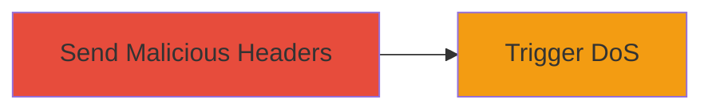

# Denial of Service via Malicious Accept and Forwarded Headers in Rack

Multi-stage attack chain demonstrating a complete attack workflow.

## Chain Metrics Dashboard

| Metric | Value |
|--------|-------|
| Chain Status | Unverified |
| Total Steps | 1 |
| Execution Time | ~1 minutes |
| Skill Level | Intermediate |
| Complexity | Low |
| Impact Level | High |

## Attack Flow Visualization



## Prerequisites & Requirements

### Required Tools

- [[commands/curl-send-malicious-headers]]

### Target Environment

- Web applications using Rack with Ruby versions prior to 3.2
- Exposed HTTP endpoints (e.g., ports 80, 443)
- No authentication required for initial requests

### Initial Access Requirements

- Network access to the target web server
- No prior credentials needed; attack via public-facing application

## Detailed Attack Procedures

### Step 1: Trigger Header Parsing DoS
procedure: [[procedures/Exploit-Rack-Header-Parsing-DoS]]

**Objective**: Send a crafted HTTP request with malicious Accept or Forwarded headers to cause excessive parsing time and resource exhaustion on the target Rack-based application.

**Instructions**: Use [[commands/curl-send-malicious-headers]] to send a request with a specially crafted header that exploits the parsing inefficiency:

```bash
curl -H "Accept: text/html,application/xhtml+xml,application/xml;q=0.9,image/webp,*/*;q=0.8" -H "Forwarded: for=127.0.0.1;proto=http;by=192.168.1.1" http://target.example.com/
```

For a more severe payload, craft a header with repeated or deeply nested parameters to amplify the parsing delay:

```bash
curl -H "Accept: "$(python3 -c 'print(";q=0.001" * 10000)') http://target.example.com/
```

Monitor server response time; successful exploitation will result in significant delays or timeouts.

**Expected Output**: The server takes excessively long to respond (e.g., >30 seconds) or returns a 500 error due to resource exhaustion.

**Success Indicators**:
- Increased CPU usage on the target server during parsing
- Request timeout or slow response from the application
- No response from the server after multiple attempts

## Attack Chain Summary

### Key Achievements

1. Successfully triggered denial of service by exploiting header parsing vulnerability in Rack.
2. Caused potential downtime for the target web application without authentication.
3. Demonstrated impact on Ruby/Rack environments pre-3.2.

## Technique & Tactic Coverage

### MITRE ATT&CK Techniques

- [[Network Denial of Service]]

### MITRE ATT&CK Tactics

- [[Impact]]

---
*Last updated: 2024-10-01T00:00:00Z*
