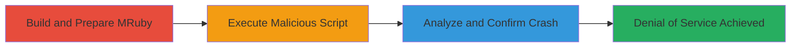

# Denial of Service via Null Pointer Dereference in MRuby VM Execution

Multi-stage attack chain demonstrating the exploitation of a null pointer dereference in MRuby's virtual machine execution, resulting in a crash of the Ruby interpreter and potential denial of service in embedded applications like Shopify Scripts.

## Chain Metrics Dashboard

| Metric | Value |
|--------|-------|
| Chain Status | Unverified |
| Total Steps | 3 |
| Execution Time | ~10 minutes |
| Skill Level | Intermediate |
| Complexity | Medium |
| Impact Level | High |

## Attack Flow Visualization



## Prerequisites & Requirements

### Required Tools

- [[tools/GCC]]
- [[tools/ASAN]]
- [[tools/GDB]]

### Target Environment

- Linux x64 platform
- MRuby source code (version as of January 31, 2017)
- Ruby 2.3.1 or compatible interpreter environment

### Initial Access Requirements

- Access to a development environment for building and running MRuby
- No network access required; local sandboxed execution
- Proof-of-concept script (vm_exec.rb) prepared with malicious 'break' statement in NoMethodError context

## Detailed Attack Procedures

### Step 1: Prepare MRuby Environment
procedure: [[procedures/Download-and-Build-MRuby-for-Analysis]]

**Objective**: Download and compile MRuby with debugging tools to enable vulnerability analysis and reproduction.

**Instructions**: Download the MRuby source code and build it using GCC with AddressSanitizer enabled to detect memory issues.

**Expected Output**: Successfully built MRuby binary with ASAN instrumentation, ready for sandboxed execution.

**Success Indicators**:
- Build completes without errors
- ASAN reports no initial memory issues in clean runs

### Step 2: Trigger the Vulnerability
procedure: [[procedures/Execute-Proof-of-Concept-Script-in-MRuby-Sandbox]]

**Objective**: Run a crafted Ruby script in the MRuby sandbox to invoke the null pointer dereference during VM execution.

**Instructions**: Execute the vm_exec.rb script using the sandbox tool, which handles a 'break' statement in a method missing context, leading to improper range object access.

Use [[commands/sandbox-execute-poc]] to run the script:

```bash
./sandbox vm_exec.rb
```

**Expected Output**: Segmentation fault at address 0x00000000000000, with ASAN reporting a null pointer dereference.

**Success Indicators**:
- Interpreter crashes immediately
- Uncontrolled resource consumption observed prior to fault

### Step 3: Confirm Exploitation
procedure: [[procedures/Analyze-Crash-Using-GDB-Debugger]]

**Objective**: Debug the crash to verify the vulnerability location and understand the root cause for potential mitigation or further exploitation.

**Instructions**: Attach GDB to the crashing process and generate a backtrace to pinpoint the null pointer access.

Run [[commands/gdb-backtrace]] within GDB after the segfault:

```bash
bt
```

**Expected Output**: Backtrace showing frames from mrb_vm_exec (vm.c:1592) through method missing handling and range creation.

**Success Indicators**:
- Null pointer confirmed in mrb_vm_exec
- Root cause traced to 'break' handling in NoMethodError contexts

## Attack Chain Summary

### Key Achievements

1. Reproduced a critical null pointer dereference in MRuby VM, causing interpreter crashes
2. Demonstrated DoS impact on applications embedding MRuby, such as Shopify Scripts
3. Provided actionable debugging steps for verification and patching

## Technique & Tactic Coverage

### MITRE ATT&CK Techniques

- [[Endpoint Denial of Service]] Endpoint Denial of Service
- [[Exploitation for Privilege Escalation]] Exploitation for Privilege Escalation

### MITRE ATT&CK Tactics

- [[Privilege Escalation]] Impact

---

*Last updated: 2024-10-01T00:00:00Z*
