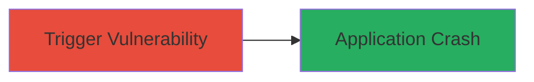

# Denial of Service via PHP bzcompress Memory Corruption

Multi-stage attack chain demonstrating a complete attack workflow.

## Chain Metrics Dashboard

| Metric | Value |
|--------|-------|
| Chain Status | Unverified |
| Total Steps | 1 |
| Execution Time | ~1 minutes |
| Skill Level | Intermediate |
| Complexity | Medium |
| Impact Level | Low |

## Attack Flow Visualization



## Prerequisites & Requirements

### Required Tools

- None required (uses native PHP functions)

### Target Environment

- PHP runtime with bz2 extension enabled
- Web server or CLI environment exposing PHP execution
- No specific ports or services beyond PHP application

### Initial Access Requirements

- Access to execute PHP code (e.g., via web upload or shell)
- No credentials needed if function is callable directly
- Network access to the PHP application if web-based

## Detailed Attack Procedures

### Step 1: Trigger bzcompress Crash
procedure: [[procedures/Trigger-PHP-bzcompress-Memory-Corruption-DoS]]

**Objective**: Exploit memory corruption in the bzcompress function to cause a denial of service through application crash.

**Instructions**: Prepare a PHP script that calls the bzcompress function with crafted input data known to trigger memory corruption. Save the script as a .php file and execute it via CLI or web request.

Example script invocation (inline for readability):

```php
<?php
$malicious_data = "crafted_input_triggering_corruption"; // Replace with fuzz-discovered input
$result = bzcompress($malicious_data, 9);
echo "Compression result: " . ($result ? 'Success' : 'Failed');
?>
```

Run the script using PHP CLI:

```bash
php exploit.php
```

Or upload and access via web if the application allows file execution.

**Expected Output**: PHP process crashes with a segmentation fault or memory error, leading to denial of service.

**Success Indicators**:
- Application or PHP process terminates unexpectedly
- Error logs show memory corruption or crash in bzcompress
- Service becomes unresponsive until restart

## Attack Chain Summary

### Key Achievements

1. Successful triggering of memory corruption in bzcompress
2. Achievement of denial of service via application crash
3. Demonstration of low-severity impact on PHP-based systems

## Technique & Tactic Coverage

### MITRE ATT&CK Techniques

- [[Endpoint Denial of Service]]

### MITRE ATT&CK Tactics

- [[Impact]]

---
*Last updated: 2023-10-01T12:00:00Z*
