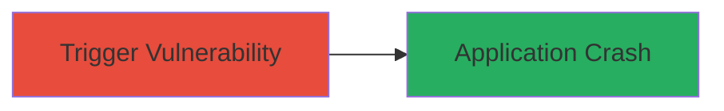

# Denial of Service via PHP implode() Memory Corruption

Multi-stage attack chain demonstrating a complete attack workflow.

## Chain Metrics Dashboard

| Metric | Value |
|--------|-------|
| Chain Status | Unverified |
| Total Steps | 1 |
| Execution Time | ~1 minute |
| Skill Level | Beginner |
| Complexity | Low |
| Impact Level | Low |

## Attack Flow Visualization



## Prerequisites & Requirements

### Required Tools

- PHP runtime environment

### Target Environment

- PHP application (version affected by bug #73364)
- Web server exposing PHP scripts (e.g., Apache with mod_php)
- No specific ports required beyond standard HTTP/HTTPS (80/443)

### Initial Access Requirements

- Access to submit input to a PHP application using implode()
- Network access to the target application
- No prior credentials needed for unauthenticated DoS

## Detailed Attack Procedures

### Step 1: Trigger Memory Corruption
procedure: [[procedures/Trigger-PHP-implode-Crash]]

**Objective**: Exploit the memory handling issue in PHP's implode() function to cause a segmentation fault or crash, resulting in denial-of-service.

**Instructions**: Prepare a malicious input that triggers the unspecified memory corruption in implode(). Submit this input to any PHP endpoint that processes arrays with implode(), such as a form or API call handling user data.

For demonstration, create a PHP script that replicates the vulnerable call:

```php
<?php
// Sample vulnerable code
$array = [/* malformed or oversized array input */]; // e.g., large or corrupted array from user input
$result = implode('', $array); // Triggers memory corruption
echo $result;
?>
```

Run the script using [[commands/php-execute-script]] to verify the crash locally:

```bash
php vulnerable_script.php
```

In a remote scenario, send crafted input via HTTP POST to the target endpoint using [[commands/curl-post-data]]:

```bash
curl -X POST -d 'data=malformed_array_input' http://target.com/vulnerable_endpoint.php
```

**Expected Output**: The PHP process crashes with a segmentation fault or similar error, leading to application downtime.

**Success Indicators**:
- Server returns 500 Internal Server Error or crashes
- PHP error logs show memory corruption (e.g., segfault in implode)
- Application becomes unresponsive until restart

## Attack Chain Summary

### Key Achievements

1. Successful trigger of memory corruption in implode()
2. Achievement of application-level DoS without authentication
3. Demonstration of low-severity impact via crash

## Technique & Tactic Coverage

### MITRE ATT&CK Techniques

- [[Endpoint Denial of Service]]

### MITRE ATT&CK Tactics

- [[Impact]]

---
*Last updated: 2023-10-01T00:00:00Z*
