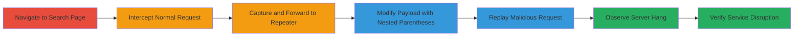

# Denial of Service via ReDoS in CS.Money Search Functionality

Multi-stage attack chain demonstrating a complete workflow to exploit a Regular Expression Denial of Service (ReDoS) vulnerability in the item search functionality of 3d.cs.money. By sending a specially crafted JSON payload with deeply nested parentheses in the 'name' parameter, the attack triggers catastrophic backtracking in the server's regex parsing, causing excessive computation that hangs the server and disrupts service availability for minutes or longer, scalable by increasing nesting depth.

## Chain Metrics Dashboard

| Metric | Value |
|--------|-------|
| Chain Status | Unverified |
| Total Steps | 7 |
| Execution Time | ~5 minutes |
| Skill Level | Intermediate |
| Complexity | Medium |
| Impact Level | High |

## Attack Flow Visualization

## Prerequisites & Requirements

### Required Tools

- [[tools/Burp-Suite]]

### Target Environment

- Web platform
- Access to https://3d.cs.money
- No specific ports or services beyond standard HTTPS (443)

### Initial Access Requirements

- Public internet access to the target site
- No credentials required
- Proxy tool configured to intercept traffic from browser

## Detailed Attack Procedures

### Step 1: Navigate to Search Page
procedure: [[procedures/Intercept-and-Capture-Search-Request-with-Burp-Suite]]

**Objective**: Load the item search interface to prepare for request interception.

**Instructions**: Open a web browser and access the CS.Money item search page to trigger the normal search functionality.

**Expected Output**: The search interface loads, allowing entry of search terms.

**Success Indicators**:
- Page loads successfully at https://3d.cs.money/item/default
- Search box is visible and functional

### Step 2: Intercept the Search Request
procedure: [[procedures/Intercept-and-Capture-Search-Request-with-Burp-Suite]]

**Objective**: Use a proxy tool to capture the outgoing POST request from a normal search.

**Instructions**: Configure Burp Suite as a proxy for your browser, enable interception, and perform a search (e.g., type "AK-47" in the search box) to capture the request.

**Expected Output**: Intercepted POST request to /api/skin/search with JSON body like {"name":"AK-47","item_name":"AK-47"} and Content-Type: application/json;charset=utf-8.

**Success Indicators**:
- Request is paused in Burp Suite proxy
- JSON payload is visible in the request body

### Step 3: Capture the POST Request
procedure: [[procedures/Intercept-and-Capture-Search-Request-with-Burp-Suite]]

**Objective**: Confirm and document the structure of the legitimate search request.

**Instructions**: Inspect the intercepted request details, including endpoint /api/skin/search, method POST, and headers.

**Expected Output**: Full request details logged, ready for forwarding.

**Success Indicators**:
- Endpoint and payload structure confirmed
- No errors in request format

### Step 4: Send the Request to Repeater
procedure: [[procedures/Intercept-and-Capture-Search-Request-with-Burp-Suite]]

**Objective**: Forward the captured request to Burp's Repeater for modification.

**Instructions**: In Burp Suite, use the 'Forward' action to send the request to the Repeater tab.

**Expected Output**: Request appears in Repeater, editable and resendable.

**Success Indicators**:
- Repeater tab shows the original request
- 'Send' button is active

### Step 5: Modify the Payload
procedure: [[procedures/Craft-and-Replay-ReDoS-Payload]]

**Objective**: Alter the 'name' parameter to include deeply nested parentheses triggering ReDoS.

**Instructions**: In Repeater, edit the JSON body to replace the 'name' value with a payload like "((((()0))))))" or deeper nesting such as "(((((()0)))))))".

**Expected Output**: Modified JSON payload in the request body.

**Success Indicators**:
- Payload updated without JSON syntax errors
- Nesting depth increased for scalability

### Step 6: Send the Modified Request
procedure: [[procedures/Craft-and-Replay-ReDoS-Payload]]

**Objective**: Replay the crafted request to exploit the vulnerability.

**Instructions**: Click 'Send' in Repeater to transmit the modified POST to /api/skin/search.

**Expected Output**: Request sent; server response delayed or absent due to hang.

**Success Indicators**:
- Request transmitted successfully
- No immediate response from server

### Step 7: Observe the Impact
procedure: [[procedures/Observe-and-Verify-DoS-Impact]]

**Objective**: Monitor the server for denial of service effects.

**Instructions**: Attempt to access the site or send normal requests while observing downtime; increase nesting for longer hangs.

**Expected Output**: Site becomes inaccessible for several minutes; deeper nesting extends disruption.

**Success Indicators**:
- Server hangs, site unresponsive
- Scalable downtime observed

## Attack Chain Summary

### Key Achievements

1. Successful interception and modification of search API requests using Burp Suite.
2. Triggered ReDoS via crafted nested parentheses payload, causing server computation overload.
3. Demonstrated scalable DoS impact, rendering the service unavailable for minutes.

## Technique & Tactic Coverage

### MITRE ATT&CK Techniques

- [[Endpoint Denial of Service]]
- [[Exploit Public-Facing Application]]

### MITRE ATT&CK Tactics

- [[Impact]]

---
*Last updated: 2024-01-01T00:00:00Z*
