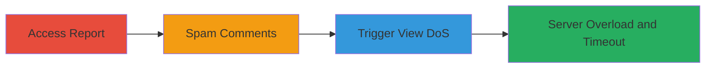

# Denial of Service via Unlimited Comment Loading in HackerOne Report View

Multi-stage attack chain demonstrating a complete denial of service workflow on the HackerOne platform by exploiting the report view functionality that loads all comments without limits.

## Chain Metrics Dashboard

| Metric | Value |
|--------|-------|
| Chain Status | Unverified |
| Total Steps | 3 |
| Execution Time | ~5-10 minutes |
| Skill Level | Intermediate |
| Complexity | Medium |
| Impact Level | High |

## Attack Flow Visualization

## Prerequisites & Requirements

### Required Tools

- Web browser (e.g., Chrome or Firefox with developer tools for inspection)

### Target Environment

- HackerOne platform (web application)
- Access to a HackerOne account, preferably with a sandboxed team for testing without rate limits impacting non-sandboxed reports
- No specific ports required; operates over standard HTTPS (port 443)

### Initial Access Requirements

- Valid HackerOne user credentials
- Ability to create or access reports (e.g., via hacker or program member role)
- Network access to hackerone.com

## Detailed Attack Procedures

### Step 1: Access or Create Report
procedure: [[procedures/Access-HackerOne-Report-for-DoS-Preparation]]

**Objective**: Gain access to a HackerOne report to prepare for comment spamming, using a sandboxed team to avoid partial rate-limiting on non-sandboxed reports.

**Instructions**: Log in to your HackerOne account and navigate to the reports section. Either create a new test report or select an existing one (e.g., report IDs like 137508 for testing). Use a sandboxed team account to ensure unrestricted access for spamming.

**Expected Output**: Successful access to the report interface, ready for adding comments.

**Success Indicators**:
- Report page loads without errors
- Comment input field is visible and functional

### Step 2: Spam Comments to Overload
procedure: [[procedures/Spam-Comments-to-Overload-HackerOne-Report]]

**Objective**: Flood the report with a large number of comments (e.g., 450 short 'test' messages or a few large payloads) to exceed server processing limits when loaded.

**Instructions**: In the report's comment section, repeatedly submit short messages like 'test' via the web interface. For efficiency, use browser automation if available, but manual submission works for ~450 comments. Alternatively, add large messages (high-entropy data to resist compression) or trigger system-generated comments. Tested on reports 137508 (short comments), 132450 (large messages), and 138662 (mixed).

**Expected Output**: Comments successfully added to the report, visible in the interface.

**Success Indicators**:
- At least 450 comments or equivalent large payload added
- No rate-limiting blocks the submissions (use sandboxed team)

### Step 3: Trigger DoS by Viewing Report
procedure: [[procedures/Trigger-DoS-by-Viewing-HackerOne-Report]]

**Objective**: Attempt to view the report, forcing the AJAX controller to load all comments at once, causing server overload and a 524 timeout error.

**Instructions**: Navigate to the report view page (e.g., via URL like https://hackerone.com/reports/137508). The system will trigger an AJAX request to fetch all comments. Monitor the network tab in browser dev tools for the request to /reports/{id}/comments.

**Expected Output**: Server returns a 524 Origin Time-Out error after ~60 seconds; legitimate users cannot access the report content.

**Success Indicators**:
- Timeout error displayed
- Increased server load observed (e.g., via monitoring tools if available)
- Request amplification if using high-entropy data

## Attack Chain Summary

### Key Achievements

1. Successfully overloads HackerOne's report view by exploiting unlimited comment loading.
2. Demonstrates impact on both sandboxed and non-sandboxed teams, preventing report access.
3. Enables potential amplification attacks with incompressible data, amplifying DoS effects.

## Technique & Tactic Coverage

### MITRE ATT&CK Techniques

- [[Exploit Public-Facing Application]]
- [[Endpoint Denial of Service]]

### MITRE ATT&CK Tactics

- [[Initial Access]]
- [[Impact]]

---
*Last updated: 2023-10-01T00:00:00Z*
