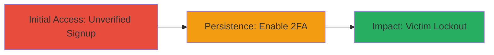

---
id: a1b2c3d4-e5f6-7890-abcd-ef1234567890
name: Denial of Service via Unverified Email Signup and 2FA Enablement on Omise Dashboard
type: attack_chain
description: An attacker exploits the lack of email verification during signup on the Omise dashboard to create an account with a victim's email and enable 2FA, resulting in permanent lockout of the legitimate user.
verified: false
submitted: false
step_count: 2
created_at: 2023-10-01T00:00:00Z
updated_at: 2023-10-01T00:00:00Z
procedures: [[procedures/Unverified-Account-Creation-on-Omise]], [[procedures/Enable-2FA-on-Unverified-Omise-Account]]
techniques: [[Create Account]], [[Endpoint Denial of Service]]
tactics: [[Initial Access]], [[Impact]]
tags: broken-access-control, 2fa-bypass, account-takeover, dos
platforms: Web
tools: []
---

# Denial of Service via Unverified Email Signup and 2FA Enablement on Omise Dashboard

Multi-stage attack chain demonstrating a complete attack workflow targeting weak account verification in the Omise payment dashboard.

## Chain Metrics Dashboard

| Metric | Value |
|--------|-------|
| Chain Status | Unverified |
| Total Steps | 2 |
| Execution Time | ~5 minutes |
| Skill Level | Beginner |
| Complexity | Low |
| Impact Level | High |

## Attack Flow Visualization

## Prerequisites & Requirements

### Required Tools

- Web browser (e.g., Chrome or Firefox)

### Target Environment

- Web platform
- Access to https://dashboard.omise.co/
- No special services or ports required beyond standard HTTPS (443)

### Initial Access Requirements

- Knowledge of victim's email address
- No prior credentials or network position needed; attack is performed remotely

## Detailed Attack Procedures

### Step 1: Unverified Account Creation
procedure: [[procedures/Unverified-Account-Creation-on-Omise]]

**Objective**: Create a fraudulent account using the victim's email address without any email verification, gaining initial control over the email-associated account.

**Instructions**: Navigate to the Omise dashboard signup page at https://dashboard.omise.co/. Enter the victim's email address along with fabricated credentials (e.g., a strong password). Submit the registration form. The process completes immediately without sending or requiring any email verification code.

**Expected Output**: Successful account creation confirmation, with the attacker now able to log in using the provided credentials.

**Success Indicators**:
- Account dashboard loads after login
- No email verification prompt appears during signup

### Step 2: Enable 2FA on Unverified Account
procedure: [[procedures/Enable-2FA-on-Unverified-Omise-Account]]

**Objective**: Activate two-factor authentication on the newly created account, preventing the legitimate user from accessing or recovering the account since they cannot receive or provide the 2FA codes.

**Instructions**: After logging into the newly created account, navigate to the account settings or security section. Locate the Two Factor Authentication option and enable it by scanning the QR code with an authenticator app (e.g., Google Authenticator) or entering a backup code. No additional verification is required for this step.

**Expected Output**: 2FA enabled status confirmation, with the account now protected by the attacker's 2FA secret.

**Success Indicators**:
- 2FA setup completes without prompts for email ownership
- Legitimate user receives no access even after attempting password reset

## Attack Chain Summary

### Key Achievements

1. Bypassed email verification to hijack account association
2. Enabled 2FA to establish persistent control
3. Caused denial of service for the victim, blocking registration, login, and recovery

## Technique & Tactic Coverage

### MITRE ATT&CK Techniques

- [[Create Account]] Create Account
- [[Endpoint Denial of Service]] Endpoint Denial of Service

### MITRE ATT&CK Tactics

- [[Initial Access]] Initial Access
- [[Impact]] Impact

---
*Last updated: 2023-10-01T00:00:00Z*
