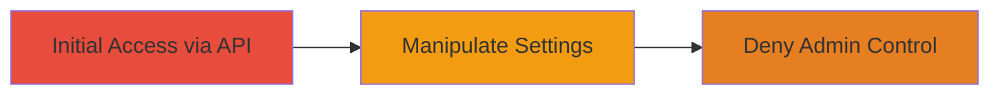

# Deny Admin Access to LinkedIn Company Page Lead Gen Forms via Unauthorized API Manipulation

Multi-stage attack chain demonstrating a complete attack workflow exploiting improper access control in LinkedIn's API.

## Chain Metrics Dashboard

| Metric | Value |
|--------|-------|
| Chain Status | Unverified |
| Total Steps | 1 |
| Execution Time | ~2 minutes |
| Skill Level | Intermediate |
| Complexity | Low |
| Impact Level | Medium |

## Attack Flow Visualization



## Prerequisites & Requirements

### Required Tools

- None (uses standard HTTP client like curl)

### Target Environment

- LinkedIn company page API
- Web platform with access to Voyager API endpoints
- No specific ports required (HTTPS on 443)

### Initial Access Requirements

- Valid LinkedIn session or API access (attacker must be authenticated but without admin privileges on the target company page)
- Knowledge of the target company ID
- Network access to LinkedIn's API (public internet)

## Detailed Attack Procedures

### Step 1: Manipulate Company Page Settings
procedure: [[procedures/Manipulate-LinkedIn-Company-Page-Settings-via-Unauthorized-API-Call]]

**Objective**: Send an unauthorized POST request to the LinkedIn API endpoint to modify Lead Gen Form visibility, preventing page admins from enabling or disabling the forms.

**Instructions**: Identify the target company ID (e.g., via LinkedIn URL or prior reconnaissance). Then, use [[commands/curl-linkedin-api-manipulate]] to send a POST request with payload that alters the visibility settings:

```bash
curl -X POST 'https://www.linkedin.com/voyager/api/voyagerOrganizationDashCompanies/{id}' \
  -H 'Content-Type: application/json' \
  -H 'Cookie: JSESSIONID=your_session; li_at=your_li_at_token' \
  -d '{"leadGenFormsVisibility": "disabled"}'
```

Replace `{id}` with the actual company ID and include valid authentication cookies or tokens from a LinkedIn session. The payload disables the Lead Gen Forms visibility.

**Expected Output**: HTTP 200 OK response indicating successful update, though the attacker lacks admin rights.

**Success Indicators**:
- API returns success without authorization error
- Admins on the company page can no longer toggle Lead Gen Form settings
- Verification by logging in as an admin and attempting to edit page features

## Attack Chain Summary

### Key Achievements

1. Bypassed access controls to modify sensitive company page settings
2. Denied administrative control over Lead Gen Forms, potentially disrupting lead generation and business operations
3. Demonstrated improper authorization in LinkedIn's Voyager API

## Technique & Tactic Coverage

### MITRE ATT&CK Techniques

- [[Exploit Public-Facing Application]]

### MITRE ATT&CK Tactics

- [[Initial Access]]

---
*Last updated: 2023-10-01T12:00:00Z*
