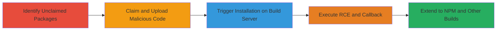

---
# Dependency Confusion Attack via Unclaimed PyPI and NPM Packages Leading to RCE on Yelp Build Servers

Multi-stage attack chain demonstrating a supply chain compromise through dependency confusion, where internal package names are unclaimed on public registries, allowing malicious uploads that execute code during installation on build servers.

## Chain Metrics Dashboard

| Metric | Value |
|--------|-------|
| Chain Status | Unverified |
| Total Steps | 5 |
| Execution Time | ~30 minutes |
| Skill Level | Intermediate |
| Complexity | Medium |
| Impact Level | High |

## Attack Flow Visualization



## Prerequisites & Requirements

### Required Tools

- [[tools/pip]]
- [[tools/npm]]
- Twine (for PyPI uploads)
- NPM CLI (for NPM uploads)

### Target Environment

- Public package registries (PyPI, NPM)
- Build servers (Jenkins on AWS, Travis CI on Google Cloud)
- Misconfigured pip/NPM in Docker images or CI environments
- No network access to internal registries prioritized

### Initial Access Requirements

- No credentials needed for public registries
- Ability to monitor public leaks of internal package names (e.g., via JavaScript files)
- Server to receive callbacks (e.g., ngrok or public endpoint)

## Detailed Attack Procedures

### Step 1: Identify Unclaimed Internal Package
procedure: [[procedures/Identify-Unclaimed-Internal-Package-on-PyPI]]

**Objective**: Discover internal package names that are unclaimed on public PyPI, enabling potential hijacking.

**Instructions**: Search for leaked internal package names, such as 'yelp-cgeom', by reviewing public sources or guessing based on company naming conventions. Use the PyPI search to check availability.

**Expected Output**: Confirmation that the package name is unclaimed.

**Success Indicators**:
- Package name like 'yelp-cgeom' returns no results on PyPI.
- Internal intent confirmed via company documentation or leaks.

### Step 2: Claim and Upload Malicious Package
procedure: [[procedures/Claim-and-Upload-Malicious-PyPI-Package]]

**Objective**: Register the unclaimed package on PyPI and upload a version with embedded malicious code in setup.py to execute on installation.

**Instructions**: Create a setup.py with a post-install script that sends a callback to your server. Use [[commands/twine-upload-pypi]] to upload the package.

```bash
twine upload dist/*
```

**Expected Output**: Package successfully published on PyPI.

**Success Indicators**:
- Upload confirmation from twine.
- Package visible on PyPI search.

### Step 3: Trigger Installation and Execute RCE
procedure: [[procedures/Trigger-Installation-on-Build-Server-for-RCE]]

**Objective**: Leverage misconfigured pip to install from public PyPI, executing the malicious setup.py on the build server for RCE.

**Instructions**: Wait for automated builds to pull the package. Monitor your callback server for hits from the build environment.

**Expected Output**: Callback received with server details (IP, hostname, directories).

**Success Indicators**:
- Callback from IP 54.71.19.248, hostname like '10-81-21-60-uswest2bdevc.uswest2-devc.yelpcorp.com'.
- Directory path indicating pip install execution.

### Step 4: Identify Similar Vulnerability on Travis CI
procedure: [[procedures/Identify-Similar-Vulnerability-on-Travis-CI]]

**Objective**: Extend the attack to other build systems like Travis CI by targeting additional unclaimed packages.

**Instructions**: Repeat the process for packages like 'clusterman_metrics', checking for installations in CI pipelines.

**Expected Output**: Additional callbacks from Travis CI environments.

**Success Indicators**:
- Callback from Google DNS IPs, hostname 'localhost', path like '/tmp/pip-install-jbvkab3_/clusterman-metrics'.

### Step 5: Exploit NPM Dependency Confusion
procedure: [[procedures/Exploit-NPM-Dependency-Confusion-on-Developer-Machines]]

**Objective**: Claim leaked internal NPM package names and upload malicious versions to compromise developer machines or builds.

**Instructions**: Scan public JavaScript files for leaked names (e.g., 'yelp-js-infra'), claim on NPM, and upload with malicious install script. Use [[commands/npm-publish]] to upload.

```bash
npm publish
```

**Expected Output**: Callbacks from developer IPs during npm install.

**Success Indicators**:
- Callbacks from IPs like 13.56.89.128, hostnames like 'dev141-uswest1adevc'.

## Attack Chain Summary

### Key Achievements

1. Achieved RCE on Jenkins build server via PyPI dependency confusion.
2. Extended compromise to Travis CI for another package.
3. Identified and exploited NPM leaks for developer machine access.

## Technique & Tactic Coverage

### MITRE ATT&CK Techniques

- [[Compromise Software Supply Chain]] Compromise Software Supply Chain: Compromise Software Development Tools
- [[Exploitation for Client Execution]] Exploitation for Client Execution
- [[Python]] Python

### MITRE ATT&CK Tactics

- [[TA0106]] Supply Chain Compromise
- [[Execution]] Execution

---
*Last updated: 2023-10-01T00:00:00Z*
