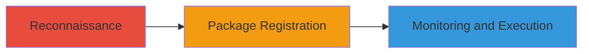

---
tags:
  - dependency-confusion
  - npm
  - supply-chain
  - rce
type: attack_chain
tools:
  - '[[tools/npm]]'
tactics:
  - '[[Initial Access]]'
  - '[[Execution]]'
commands:
  - '[[commands/npm-search]]'
  - '[[commands/npm-init]]'
  - '[[commands/npm-publish-package]]'
  - '[[commands/npm-install-observe]]'
platforms:
  - Web
  - Cloud
complexity: medium
procedures:
  - '[[procedures/Identify-Unregistered-Internal-NPM-Packages]]'
  - '[[procedures/Register-and-Upload-Malicious-NPM-Packages]]'
  - '[[procedures/Monitor-and-Confirm-Package-Downloads]]'
step_count: 3
techniques:
  - '[[Supply Chain Compromise]]'
  - '[[Command-Line Interface]]'
description: >-
  Exploits dependency confusion in npm configurations by registering internal
  package names publicly, leading to malicious code installation and potential
  RCE in development environments
skill_level: intermediate
impact_level: high
id: 6345dd05-fee7-4023-95aa-d483b49ea5fb
created_at: '2025-12-11T06:10:40.157Z'
updated_at: '2025-12-11T06:10:40.157Z'
verified: false
validated: true
submitted: true
mitre_tactics:
  - '[[TA0001]]'
  - '[[TA0002]]'
mitre_techniques:
  - '[[T1195]]'
  - '[[T1059]]'
---
# Dependency Confusion via Unregistered NPM Packages Leading to Potential RCE

Multi-stage attack chain demonstrating exploitation of dependency confusion in npm setups, where internal package names are fetched from the public registry if unregistered, allowing malicious code injection.

## Chain Metrics Dashboard

| Metric | Value |
|--------|-------|
| Chain Status | Unverified |
| Total Steps | 3 |
| Execution Time | ~15 minutes |
| Skill Level | Intermediate |
| Complexity | Medium |
| Impact Level | High |

## Attack Flow Visualization



## Prerequisites & Requirements

### Required Tools

- [[tools/npm]]

### Target Environment

- Platform: Web/Cloud with Node.js and npm
- Required services/ports: NPM registry access
- Network access requirements: Public internet access to NPM registry

### Initial Access Requirements

- Credential requirements: NPM account for publishing
- Network position: External attacker
- Prior access needed: None, public registry exploitation

## Detailed Attack Procedures

## Step 1: Reconnaissance - [[procedures/Identify-Unregistered-Internal-NPM-Packages]]

**Procedure**: [[procedures/Identify-Unregistered-Internal-NPM-Packages]]

**Objective**: Analyze target development projects to find internal package names that are not registered on the public NPM registry.

**Expected Output**: List of unregistered internal package names.

**Success Indicators**:
- Identified package names that default to public registry.
- No public registration confirmed.

First, search for internal package names by analyzing public code repositories or leaks. Use [[commands/npm-search]] to check if they exist publicly:

```bash
npm search internal-package-name
```

If not found, note them for the next step.

## Step 2: Package Registration - [[procedures/Register-and-Upload-Malicious-NPM-Packages]]

**Procedure**: [[procedures/Register-and-Upload-Malicious-NPM-Packages]]

**Objective**: Create and publish packages with the identified names to the public NPM registry, potentially including malicious code or monitoring scripts.

**Expected Output**: Packages successfully published and available on the public registry.

**Success Indicators**:
- Package upload confirmed via NPM dashboard.
- Malicious payload embedded if intended.

Create a new package directory and initialize it with [[commands/npm-init]]:

```bash
mkdir malicious-package && cd malicious-package
npm init -y
```

Add malicious code to index.js, then publish with [[commands/npm-publish-package]]:

```bash
npm publish
```

## Step 3: Monitoring and Confirmation - [[procedures/Monitor-and-Confirm-Package-Downloads]]

**Procedure**: [[procedures/Monitor-and-Confirm-Package-Downloads]]

**Objective**: Observe downloads from the target's systems, confirming the dependency confusion and potential code execution.

**Expected Output**: Logs showing downloads from target IP ranges or systems.

**Success Indicators**:
- Download events captured.
- No prior malicious activity, but vulnerability confirmed.

Use a monitoring script in the package or external logging. Simulate installation observation with [[commands/npm-install-observe]]:

```bash
npm install internal-package-name --loglevel=verbose
```

Monitor NPM analytics or embedded beacons for target system interactions.

## Attack Chain Summary

### Key Achievements

1. Identification of vulnerable internal package names.
2. Successful registration and potential injection of malicious code.
3. Confirmation of dependency confusion leading to potential RCE.

## Technique & Tactic Coverage

### MITRE ATT&CK Techniques

- [[Supply Chain Compromise]]
- [[Command-Line Interface]]

### MITRE ATT&CK Tactics

- [[Initial Access]]
- [[Execution]]

*Last updated: 2023-10-01*
