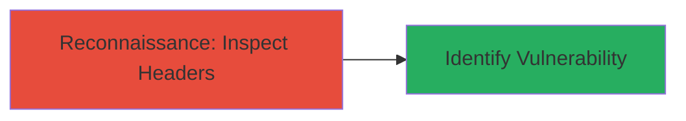

# Detect Clickjacking Vulnerability via Missing X-Frame-Options Header

Multi-stage attack chain demonstrating a reconnaissance workflow to identify potential clickjacking risks on web targets like shop.khanacademy.org.

## Chain Metrics Dashboard

| Metric | Value |
|--------|-------|
| Chain Status | Unverified |
| Total Steps | 1 |
| Execution Time | ~1 minute |
| Skill Level | Beginner |
| Complexity | Low |
| Impact Level | Informational |

## Attack Flow Visualization



## Prerequisites & Requirements

### Required Tools

- [[tools/curl]]

### Target Environment

- Web platform
- Publicly accessible HTTP/HTTPS endpoints
- No special services or ports required beyond standard web (80/443)

### Initial Access Requirements

- Internet access to the target URL
- No credentials or prior access needed

## Detailed Attack Procedures

### Step 1: Inspect Response Headers
procedure: [[procedures/Inspect-HTTP-Headers-for-Clickjacking-Protection]]

**Objective**: Send a HEAD request to the target URL to retrieve and analyze HTTP response headers, specifically checking for the presence of X-Frame-Options or other frame-busting protections.

**Instructions**: Use [[commands/curl-inspect-headers]] to fetch the headers from the root URL of the target site:

```bash
curl -L -I http://shop.khanacademy.org/
```

Review the output for security headers. Look for X-Frame-Options (e.g., DENY or SAMEORIGIN). If absent, the site is vulnerable to clickjacking via iframe embedding.

**Expected Output**: HTTP/1.1 200 OK response with headers such as Server: nginx, X-XSS-Protection: 1; mode=block, but no X-Frame-Options.

**Success Indicators**:
- Headers retrieved without errors
- Absence of X-Frame-Options confirmed, indicating potential clickjacking risk
- Presence of other headers like X-XSS-Protection noted for context

## Attack Chain Summary

### Key Achievements

1. Identified missing frame-busting header on shop.khanacademy.org
2. Confirmed vulnerability to UI redressing attacks
3. Provided informative report on potential clickjacking impact

## Technique & Tactic Coverage

### MITRE ATT&CK Techniques

- [[Vulnerability Scanning]] Vulnerability Scanning
- [[Client Configurations]] Gather Victim Host Information: Client Configurations

### MITRE ATT&CK Tactics

- [[Reconnaissance]] Reconnaissance

---
*Last updated: 2023-10-01T00:00:00Z*
