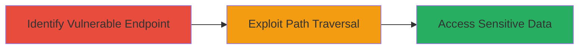

---
tags:
  - path-traversal
  - directory-traversal
  - cgi
  - web-vulnerability
  - dod
type: attack_chain
tools: []
tactics:
  - '[[Initial Access]]'
  - '[[Discovery]]'
verified: false
platforms:
  - Web
  - Linux
submitted: true
complexity: medium
created_at: '2023-10-01T00:00:00Z'
procedures:
  - '[[procedures/Identify-Vulnerable-CGI-Endpoint]]'
  - '[[procedures/Exploit-DIR-Parameter-Traversal]]'
step_count: 2
techniques:
  - '[[Exploit Public-Facing Application]]'
  - '[[File and Directory Discovery]]'
updated_at: '2025-12-14T17:26:05.681Z'
description: >-
  A path traversal vulnerability in a CGI script on a U.S. Department of Defense
  web application allows arbitrary directory access, exposing sensitive Linux
  server contents like /etc and /var.
skill_level: intermediate
impact_level: high
id: a1edbf82-a514-482e-b4a6-16ea30abfb42
validated: true
mitre_tactics:
  - '[[Initial Access]]'
  - '[[Discovery]]'
mitre_techniques:
  - '[[Exploit Public-Facing Application]]'
  - '[[File and Directory Discovery]]'
---
# Directory Traversal in DoD CGI Script to Access Sensitive Server Files

Multi-stage attack chain demonstrating a complete attack workflow exploiting a path traversal vulnerability in a CGI script on a U.S. Department of Defense web application.

## Chain Metrics Dashboard

| Metric | Value |
|--------|-------|
| Chain Status | Unverified |
| Total Steps | 2 |
| Execution Time | ~5 minutes |
| Skill Level | Intermediate |
| Complexity | Medium |
| Impact Level | High |

## Attack Flow Visualization



## Prerequisites & Requirements

### Required Tools

- Web browser or [[tools/curl]]

### Target Environment

- Linux-based web server
- CGI-enabled web application
- Publicly accessible HTTP/HTTPS ports (80/443)

### Initial Access Requirements

- No credentials required
- Direct network access to the target web application
- No prior access needed; exploitable via public-facing endpoint

## Detailed Attack Procedures

### Step 1: Identify Vulnerable Endpoint
procedure: [[procedures/Identify-Vulnerable-CGI-Endpoint]]

**Objective**: Locate the CGI script endpoint that accepts a DIR parameter for directory listing across multiple pages of the web application.

**Instructions**: Manually browse the target DoD web application pages to identify references to the /aerosol-bin/███████/display_directory_████_t.cgi script. Note paths under /aerosol-bin/... that include the DIR parameter.

**Expected Output**: Confirmation of the endpoint URL structure, e.g., https://target.gov/aerosol-bin/███████/display_directory_████_t.cgi.

**Success Indicators**:
- Endpoint found on multiple pages
- DIR parameter observed in URL queries

### Step 2: Exploit Path Traversal
procedure: [[procedures/Exploit-DIR-Parameter-Traversal]]

**Objective**: Test and exploit the DIR parameter to traverse outside the web root and access sensitive directories like /etc and /var.

**Instructions**: Append traversal payloads to the DIR parameter using a browser or curl. Start with ?DIR=/etc to list /etc contents, then ?DIR=/var and ?DIR=/var/lib.

For example, using [[commands/curl-directory-traversal-test]]:

```bash
curl "https://target.gov/aerosol-bin/███████/display_directory_████_t.cgi?DIR=/etc"
```

Follow up with additional paths to enumerate libraries and sensitive files.

**Expected Output**: Directory listings revealing system files, installed libraries, and sensitive contents.

**Success Indicators**:
- Unauthorized directory contents displayed
- Exposure of critical paths like /etc/passwd or /var/log

## Attack Chain Summary

### Key Achievements

1. Identified a hidden CGI endpoint vulnerable to path traversal on a DoD web app.
2. Exploited the DIR parameter to access restricted Linux server directories.
3. Exposed sensitive information, enabling potential further compromise such as credential theft or server takeover.

## Technique & Tactic Coverage

### MITRE ATT&CK Techniques

- [[Exploit Public-Facing Application]]
- [[File and Directory Discovery]]

### MITRE ATT&CK Tactics

- [[Initial Access]]
- [[Discovery]]

---
*Last updated: 2023-10-01T00:00:00Z*
